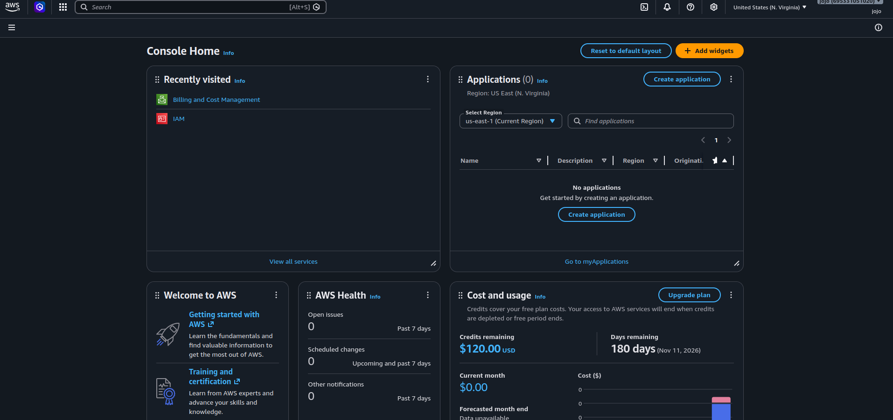
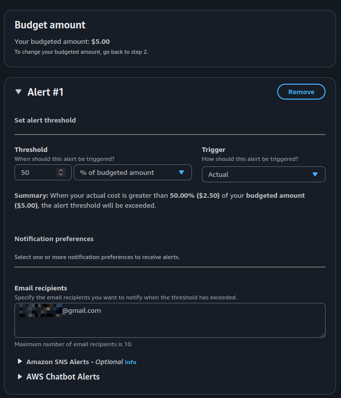
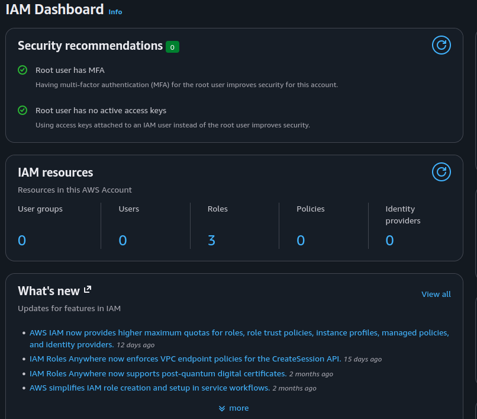
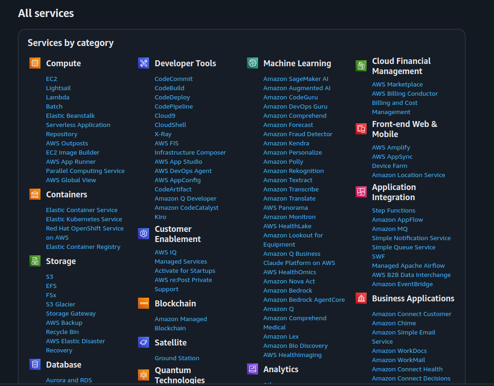
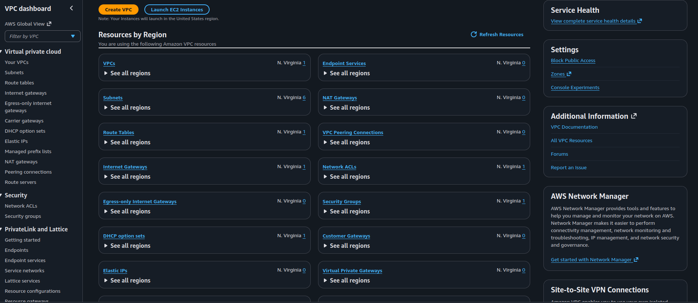
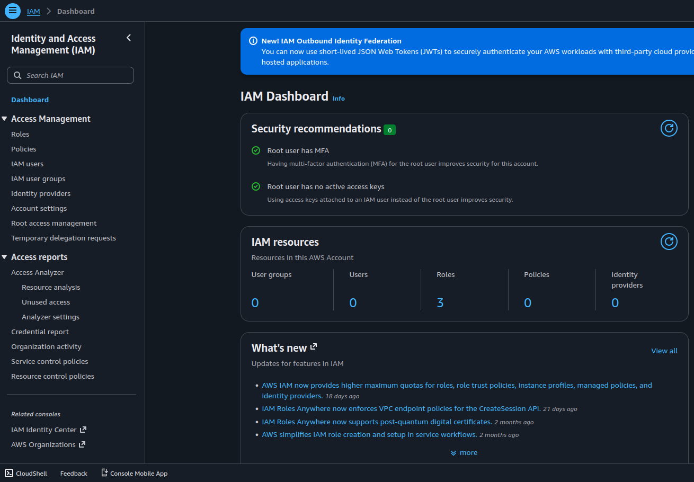
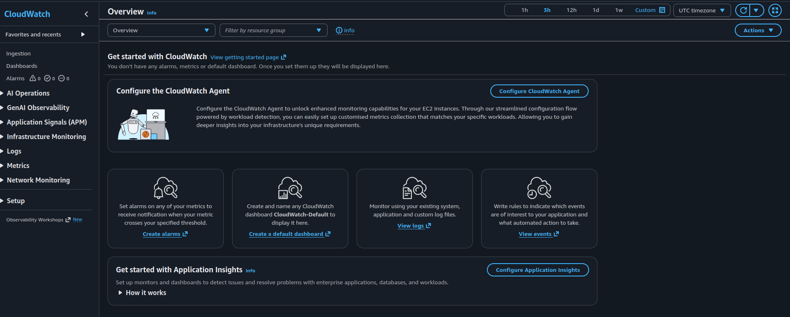

# AWS-Cloud-Journey
Documenting my structured journey from networking fundamentals to advanced cloud architecture. This repository follows a comprehensive roadmap focused on mastering AWS core services while deep-diving into VPC design, hybrid connectivity, and cloud security. Exploring how traditional networking logic scales within the AWS global infrastructure.


# ☁️ AWS Cloud Journey — Week 1, Day 1: Account Setup & Console Exploration

> **Roadmap:** AWS Cloud Networking → Cloud Network Security  
> **Phase:** 1 — Foundation  
> **Background:** Linux · CCNA Networking  
> **Date Completed:** May 2026

---

## 📋 Table of Contents
- [Overview](#overview)
- [Task 1 — Create AWS Free-Tier Account](#task-1--create-aws-free-tier-account)
- [Task 2 — Set Billing Alert](#task-2--set-billing-alert)
- [Task 3 — Enable MFA on Root Account](#task-3--enable-mfa-on-root-account)
- [Task 4 — Explore the AWS Console (300 mins)](#task-4--explore-the-aws-console-300-mins)
- [Key Takeaways](#key-takeaways)
- [What's Next](#whats-next)

---

## Overview

This is **Day 1 of my AWS Cloud Networking roadmap**. Today's focus was getting my environment fully set up, securing the root account, and spending quality time exploring the AWS Management Console. All four tasks were completed successfully.

| Item | Detail |
|---|---|
| **Week** | Week 1 |
| **Day** | Monday |
| **Focus** | Account Setup & Security Baseline |
| **Time Invested** | ~5 hours |
| **AWS Free Tier** | ✅ Active |
| **Status** | ✅ All tasks completed |

---

## Task 1 — Create AWS Free-Tier Account

### What I did
Created a new AWS account using the free tier at [aws.amazon.com/free](https://aws.amazon.com/free). During signup, AWS requested a credit card for identity verification — a small $1 temporary hold was placed and immediately reversed.

### Why this matters
The free tier gives access to:
- **750 hrs/month** of EC2 t2.micro (enough for all labs)
- **5 GB** of S3 storage
- **1 million** Lambda requests/month
- **25 GB** DynamoDB storage




*AWS console homepage after successful account creation*

---

## Task 2 — Set Billing Alert

### What I did
Navigated to **Billing & Cost Management → Budgets → Create Budget** and set a cost alert at **$5/month**.

### Why this matters
Without a billing alert, it's easy to leave a resource running (NAT Gateway, EC2) and get an unexpected bill. This is your first line of defence.

### Steps taken
1. Go to **Billing Dashboard** → **Budgets**
2. Click **Create Budget** → Choose **Cost Budget**
3. Set budget amount: `$5.00`
4. Add email alert at `50% of budgeted amount`
5. Confirm — alert email received ✅




*Billing budget configured at $5 with email notification*

---

## Task 3 — Enable MFA on Root Account

### What I did
Enabled **Multi-Factor Authentication (MFA)** on the root account using a virtual authenticator app (Google Authenticator / Authy).

### Why this matters
The root account has **unrestricted access** to everything in AWS. If compromised, it's game over. MFA adds a critical second layer of protection.

> ⚠️ **Best practice:** After enabling MFA, only use the root account for account-level tasks. All daily work should go through IAM users.

### Steps taken
1. Go to **IAM Dashboard** → **Security recommendations**
2. Click **Add MFA for root user**
3. Choose **Authenticator app**
4. Scan the QR code with your authenticator app
5. Enter two consecutive OTP codes to confirm
6. MFA status: ✅ Enabled




*Root account MFA enabled in IAM Security Credentials*

---

## Task 4 — Explore the AWS Console (300 mins)

### What I did
Spent **300 minutes (5 hours)** exploring the AWS Management Console across multiple service categories before touching any lab work.

### Services I explored

#### 🖥️ Compute
| Service | What I Learned |
|---|---|
| **EC2** | Instance types, AMIs, key pairs, launch wizard |
| **Lambda** | Serverless concept, function triggers |
| **Elastic Beanstalk** | PaaS concept vs raw EC2 |

#### 🌐 Networking
| Service | What I Learned |
|---|---|
| **VPC** | Default VPC structure, subnets, route tables |
| **Route 53** | DNS service, hosted zones concept |
| **CloudFront** | CDN concept, edge locations |
| **Direct Connect** | Dedicated AWS connection concept |


#### 🗄️ Storage
| Service | What I Learned |
|---|---|
| **S3** | Bucket concept, storage classes |
| **EBS** | Block storage, attaches to EC2 |
| **EFS** | Shared file storage, NFS protocol |

#### 🔐 Security & Identity
| Service | What I Learned |
|---|---|
| **IAM** | Users, groups, roles, policies structure |
| **KMS** | Key management, encryption concepts |
| **GuardDuty** | Threat detection service overview |
| **Security Hub** | Centralised security findings |

#### 📊 Monitoring
| Service | What I Learned |
|---|---|
| **CloudWatch** | Metrics, alarms, log groups |
| **CloudTrail** | API call logging, governance |
| **AWS Config** | Compliance and resource tracking |

### Key observations

- **Regions matter** — Every service defaults to a specific region. Resources in one region are invisible in another. Set your default region to the closest one.
- **Global vs regional services** — IAM and Route 53 are **global**. EC2, VPC, and S3 buckets are **regional**.
- **Service interconnections** — EC2 can't work without VPC, IAM roles, and Security Groups. Nothing in AWS is standalone.
- **CCNA maps directly to AWS** — VPC, subnets, route tables, and NACLs are the same concepts from CCNA — just cloud-hosted.



*AWS Management Console — all service categories*



*VPC dashboard — recognising the CCNA concepts*



*IAM dashboard — users, groups, roles, policies*



*CloudWatch — metrics and monitoring overview*

---

## Key Takeaways

```
✅ AWS free tier active, billing protection in place
✅ Root account secured with MFA — not for daily use
✅ Explored 15+ services: compute, networking, storage, security
✅ CCNA knowledge maps directly to AWS VPC concepts
✅ Understood global vs regional service distinction
```

### One thing that surprised me
AWS auto-creates a **default VPC** in every region with subnets and an Internet Gateway already configured. Convenient for testing, but not production-ready. Always build a custom VPC — covered in **Week 4**.

### One thing that connected with my background
The VPC console shows **route tables, subnets, and NACLs** — all from CCNA. The mental model is identical. AWS just removes the physical hardware.

---

## What's Next

| Day | Focus |
|---|---|
| **Tuesday** | IAM users, groups, and attaching policies |
| **Wednesday** | Custom IAM policies + policy simulator |
| **Thursday** | IAM roles — when to use roles vs users |
| **Friday** | AWS CLI setup on Linux + authentication |
| **Saturday** | Full IAM lab rebuild from scratch |
| **Sunday** | Review + AWS Well-Architected Security reading |

---

## 🛠️ Resources Used

- [AWS Free Tier](https://aws.amazon.com/free/)
- [AWS Management Console](https://console.aws.amazon.com/)
- [AWS IAM Docs](https://docs.aws.amazon.com/iam/)
- [AWS Well-Architected Framework](https://aws.amazon.com/architecture/well-architected/)

---

## 📁 Folder Structure for GitHub

```
week1-monday/
├── screenshots/
│   ├── 01_account_created.png
│   ├── 02_billing_alert.png
│   ├── 03_mfa_enabled.png
│   ├── 04_console_explore.png
│   ├── 05_vpc_dashboard.png
│   ├── 06_iam_dashboard.png
│   └── 07_cloudwatch.png
└── week1_monday_aws_setup.md
```


---

*Part of my AWS Cloud Networking roadmap — from Linux & CCNA background to Cloud Network Security Engineer.*