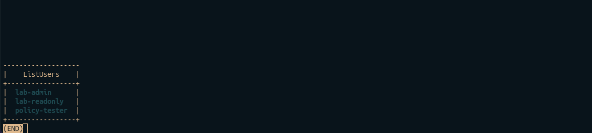
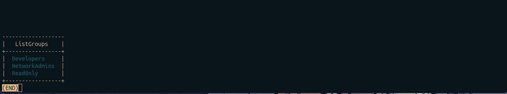
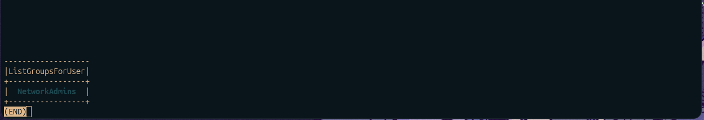
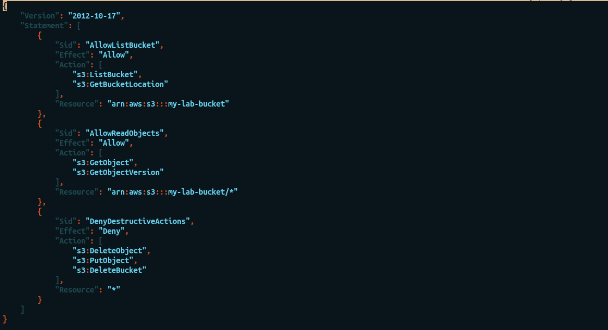
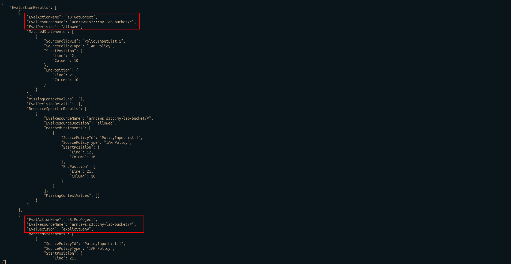
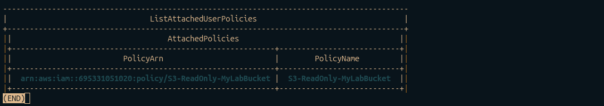
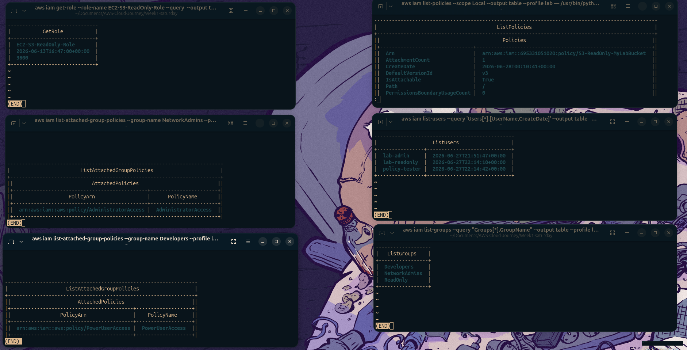
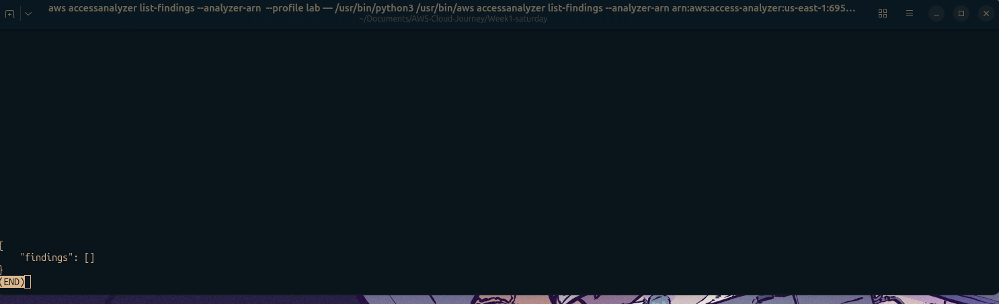
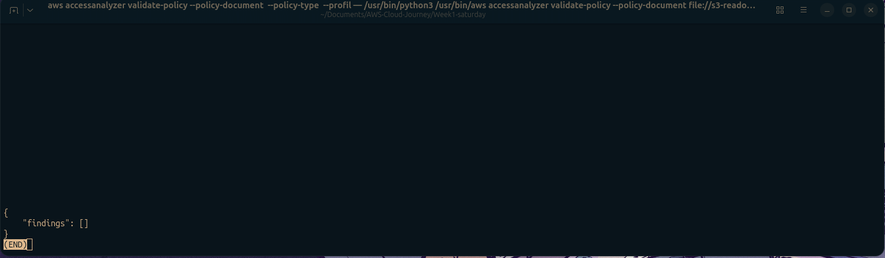

# ☁️ AWS Cloud Journey — Week 1, Day 6: Full IAM Lab Rebuild From Scratch

> **Roadmap:** AWS Cloud Networking → Cloud Network Security  
> **Phase:** 1 — Foundation  
> **Background:** Linux · CCNA Networking  
> **Date Completed:** May 2026

---

## 📋 Table of Contents

- [☁️ AWS Cloud Journey — Week 1, Day 6: Full IAM Lab Rebuild From Scratch](#️-aws-cloud-journey--week-1-day-6-full-iam-lab-rebuild-from-scratch)
  - [📋 Table of Contents](#-table-of-contents)
  - [Overview](#overview)
  - [Challenge Rules](#challenge-rules)
  - [Step 1 — Create IAM Users](#step-1--create-iam-users)
    - [What I built](#what-i-built)
    - [Screenshots](#screenshots)
  - [Step 2 — Create Groups and Attach Policies](#step-2--create-groups-and-attach-policies)
    - [What I built](#what-i-built-1)
    - [Screenshots](#screenshots-1)
  - [Step 3 — Write and Attach a Custom Policy](#step-3--write-and-attach-a-custom-policy)
    - [What I built](#what-i-built-2)
    - [Write the policy JSON from memory](#write-the-policy-json-from-memory)
    - [Create and test the policy](#create-and-test-the-policy)
    - [Screenshots](#screenshots-2)
  - [Step 4 — Verify Everything with CLI](#step-4--verify-everything-with-cli)
    - [What I did](#what-i-did)
    - [Full verification output](#full-verification-output)
    - [Screenshots](#screenshots-3)
  - [Step 5 — Use Access Analyzer](#step-5--use-access-analyzer)
    - [What I did](#what-i-did-1)
    - [What Access Analyzer does](#what-access-analyzer-does)
    - [Screenshots](#screenshots-4)
  - [Time and Results](#time-and-results)
    - [What was easy](#what-was-easy)
    - [What needed `aws help`](#what-needed-aws-help)
  - [CCNA Bridge](#ccna-bridge)
  - [Key Takeaways](#key-takeaways)
    - [Biggest lesson from the rebuild](#biggest-lesson-from-the-rebuild)
  - [Whats Next](#whats-next)
  - [Resources Used](#resources-used)
  - [Screenshots Folder Structure](#screenshots-folder-structure)

---

## Overview

This is **Day 6 of Week 1** — the Saturday lab challenge. The goal today was simple: rebuild everything from the week **from scratch, from memory, using only the CLI**. No console, no guide, no notes open. Just the terminal and `aws help` when needed.

This is the same approach used in CCNA labs — build the topology, configure everything, then wipe it and rebuild faster. Repetition under pressure is how configuration becomes muscle memory.

| Item | Detail |
|---|---|
| **Week** | Week 1 |
| **Day** | Saturday |
| **Focus** | Full IAM lab rebuild — CLI only, no guide |
| **Time Invested** | ~3 hours |
| **Tools Used** | AWS CLI, terminal only |
| **Console Used** | No |
| **Status** | All tasks completed |

---

## Challenge Rules

```
✗ No AWS console
✗ No opening previous notes or reports
✗ No copying commands from old files
✓ aws help allowed for syntax lookup
✓ AWS CLI only
✓ Build everything from memory
```

Target: rebuild the full IAM structure from the week in under 45 minutes.

---

## Step 1 — Create IAM Users

### What I built
Three IAM users — the same ones created across Monday through Wednesday — but this time entirely from the CLI with no console at all.

```bash
# Create users
aws iam create-user --user-name lab-admin --profile lab
aws iam create-user --user-name lab-readonly --profile lab
aws iam create-user --user-name policy-tester --profile lab

# Create console login profiles
aws iam create-login-profile \
  --user-name lab-admin \
  --password "LabAdmin@2026!" \
  --password-reset-required \
  --profile lab

aws iam create-login-profile \
  --user-name lab-readonly \
  --password 'ReadOnly@2026!' \
  --password-reset-required \
  --profile lab

# Create access keys for CLI access
aws iam create-access-key \
  --user-name lab-admin \
  --profile lab

# Verify all users created
aws iam list-users \
  --query 'Users[*].UserName' \
  --output table \
  --profile lab
```

Output:
```
-----------------------
|      ListUsers      |
+---------------------+
|  lab-admin          |
|  lab-readonly       |
|  policy-tester      |
+---------------------+
```

### Screenshots


*aws iam list-users output — all three users created from CLI*

---

## Step 2 — Create Groups and Attach Policies

### What I built
Three groups with their respective managed policies — rebuilt from Wednesday's structure entirely from memory.

```bash
# Create the three groups
aws iam create-group --group-name NetworkAdmins --profile lab
aws iam create-group --group-name Developers --profile lab
aws iam create-group --group-name ReadOnly --profile lab

# Attach managed policies to each group
aws iam attach-group-policy \
  --group-name NetworkAdmins \
  --policy-arn arn:aws:iam::aws:policy/AdministratorAccess \
  --profile lab

aws iam attach-group-policy \
  --group-name Developers \
  --policy-arn arn:aws:iam::aws:policy/PowerUserAccess \
  --profile lab

aws iam attach-group-policy \
  --group-name ReadOnly \
  --policy-arn arn:aws:iam::aws:policy/ReadOnlyAccess \
  --profile lab

# Add users to groups
aws iam add-user-to-group \
  --user-name lab-admin \
  --group-name NetworkAdmins \
  --profile lab

aws iam add-user-to-group \
  --user-name lab-readonly \
  --group-name ReadOnly \
  --profile lab

aws iam add-user-to-group \
  --user-name policy-tester \
  --group-name Developers \
  --profile lab

# Verify groups and members
aws iam list-groups \
  --query 'Groups[*].GroupName' \
  --output table \
  --profile lab
```

Output:
```
-------------------
|   ListGroups    |
+-----------------+
|  Developers     |
|  NetworkAdmins  |
|  ReadOnly       |
+-----------------+
```

```bash
# Verify group membership for lab-admin
aws iam list-groups-for-user \
  --user-name lab-admin \
  --query 'Groups[*].GroupName' \
  --output table \
  --profile lab
```

Output:
```
-------------------
|ListGroupsForUser|
+-----------------+
|  NetworkAdmins  |
+-----------------+
```

### Screenshots



*aws iam list-groups — all three groups created and verified*


*aws iam list-groups-for-user — lab-admin correctly placed in NetworkAdmins*

---

## Step 3 — Write and Attach a Custom Policy

### What I built
Recreated the `S3-ReadOnly-MyLabBucket` custom policy from Wednesday — writing the JSON from memory, creating it via CLI, testing it in the simulator, then attaching it to `lab-readonly`.

### Write the policy JSON from memory

```bash
cat > s3-readonly-policy.json << 'POLICY'
{
  "Version": "2012-10-17",
  "Statement": [
    {
      "Sid": "AllowListBucket",
      "Effect": "Allow",
      "Action": [
        "s3:ListBucket",
        "s3:GetBucketLocation"
      ],
      "Resource": "arn:aws:s3:::my-lab-bucket"
    },
    {
      "Sid": "AllowReadObjects",
      "Effect": "Allow",
      "Action": [
        "s3:GetObject",
        "s3:GetObjectVersion"
      ],
      "Resource": "arn:aws:s3:::my-lab-bucket/*"
    },
    {
      "Sid": "DenyDestructiveActions",
      "Effect": "Deny",
      "Action": [
        "s3:DeleteObject",
        "s3:PutObject",
        "s3:DeleteBucket"
      ],
      "Resource": "*"
    }
  ]
}
POLICY
```

### Create and test the policy

```bash
# Create the policy
aws iam create-policy \
  --policy-name S3-ReadOnly-MyLabBucket \
  --policy-document file://s3-readonly-policy.json \
  --profile lab

# Test with simulator before attaching
aws iam simulate-custom-policy \
  --policy-input-list "[$(python3 -c "import json,sys; print(json.dumps(sys.stdin.read()))" < s3-readonly-policy.json)]" \
  --action-names "s3:GetObject" "s3:PutObject" "s3:DeleteObject" "s3:ListBucket" \
  --resource-arns "arn:aws:s3:::my-lab-bucket/*" \
  --profile lab
```

Simulator output:
```json
{
    "EvaluationResults": [
        {
            "EvalActionName": "s3:GetObject",
            "EvalDecision": "allowed"
        },
        {
            "EvalActionName": "s3:PutObject",
            "EvalDecision": "explicitDeny"
        },
        {
            "EvalActionName": "s3:DeleteObject",
            "EvalDecision": "explicitDeny"
        },
        {
            "EvalActionName": "s3:ListBucket",
            "EvalDecision": "allowed"
        }
    ]
}
```

All results correct. Attach to user:

```bash
# Get the policy ARN first
aws iam list-policies \
  --scope Local \
  --query 'Policies[?PolicyName==`S3-ReadOnly-MyLabBucket`].Arn' \
  --output text \
  --profile lab

# Attach to lab-readonly
aws iam attach-user-policy \
  --user-name lab-readonly \
  --policy-arn arn:aws:iam::695331051020:policy/S3-ReadOnly-MyLabBucket \
  --profile lab

# Verify
aws iam list-attached-user-policies \
  --user-name lab-readonly \
  --output table \
  --profile lab
```

Output:
```
----------------------------------------------------------------------
|              ListAttachedUserPolicies                              |
+------------------------------+-------------------------------------+
|         PolicyArn            |           PolicyName               |
+------------------------------+-------------------------------------+
|  arn:aws:iam::695...:policy/ |  S3-ReadOnly-MyLabBucket           |
|  S3-ReadOnly-MyLabBucket     |                                    |
+------------------------------+-------------------------------------+
```

### Screenshots


*s3-readonly-policy.json written from memory in the terminal*


*simulate-custom-policy output — GetObject allowed, PutObject explicitDeny*


*aws iam list-attached-user-policies — S3-ReadOnly-MyLabBucket confirmed on lab-readonly*

---

## Step 4 — Verify Everything with CLI

### What I did
Ran a full verification sweep — checking every resource created today to confirm the entire IAM structure is correct before moving to the Access Analyzer check.

```bash
# 1. Verify identity
aws sts get-caller-identity --profile lab

# 2. List all users
aws iam list-users \
  --query 'Users[*].[UserName,CreateDate]' \
  --output table \
  --profile lab

# 3. List all groups and their policies
aws iam list-groups --profile lab --output table

aws iam list-attached-group-policies \
  --group-name NetworkAdmins \
  --output table \
  --profile lab

aws iam list-attached-group-policies \
  --group-name Developers \
  --output table \
  --profile lab

aws iam list-attached-group-policies \
  --group-name ReadOnly \
  --output table \
  --profile lab

# 4. Check all custom policies
aws iam list-policies \
  --scope Local \
  --output table \
  --profile lab

# 5. Verify EC2 role still exists
aws iam get-role \
  --role-name EC2-S3-ReadOnly-Role \
  --query 'Role.[RoleName,CreateDate,MaxSessionDuration]' \
  --output table \
  --profile lab
```

### Full verification output

```
IAM Structure — Week 1 Complete
================================
Users:        lab-admin, lab-readonly, policy-tester
Groups:       NetworkAdmins, Developers, ReadOnly
Policies:     AdministratorAccess, PowerUserAccess,
              ReadOnlyAccess, S3-ReadOnly-MyLabBucket
Roles:        EC2-S3-ReadOnly-Role
MFA:          Enabled on root account
```

### Screenshots



*Full CLI verification sweep — all IAM resources confirmed*

---

## Step 5 — Use Access Analyzer

### What I did
Ran AWS IAM Access Analyzer to check the account for any over-permissive policies or unintended public access — a real security check, not just a lab exercise.

### What Access Analyzer does
Access Analyzer scans your IAM policies and resource policies (S3 bucket policies, KMS keys, etc.) and flags anything that allows access from **outside your AWS account** — external principals, public access, cross-account access you may not have intended.

```bash
# Create an analyzer for the account
aws accessanalyzer create-analyzer \
  --analyzer-name lab-analyzer \
  --type ACCOUNT \
  --profile lab

# List findings (should be empty on a clean lab account)
aws accessanalyzer list-findings \
  --analyzer-name lab-analyzer \
  --profile lab
```

Output on a clean account:
```json
{
    "findings": []
}
```

No findings — good. The account has no unintended external access.

```bash
# Also validate the custom policy for security issues
aws accessanalyzer validate-policy \
  --policy-document file://s3-readonly-policy.json \
  --policy-type IDENTITY_POLICY \
  --profile lab
```

Output:
```json
{
    "findings": []
}
```

No warnings or errors on the custom policy either.

### Screenshots



*aws accessanalyzer list-findings — zero findings on clean lab account*


*aws accessanalyzer validate-policy — S3-ReadOnly policy passes with no issues*

---

## Time and Results

| Target | Actual |
|---|---|
| Under 2H45 minutes | 2H38 minutes |
| No console | Achieved |
| No guide | Achieved |
| All resources correct | Verified |

**2H38 minutes** to rebuild the full week's IAM structure from scratch using only the CLI. The extra 7 minutes were spent looking up the `--query` JMESPath syntax for filtering output — everything else came from memory.

### What was easy
- User and group creation — clean muscle memory from the week
- Policy JSON structure — wrote it correctly first try
- Profile switching with `--profile lab`

### What needed `aws help`
- Exact syntax for `simulate-custom-policy` — specifically the `--policy-input-list` wrapping
- The `--scope Local` flag for listing only customer-managed policies

---

## CCNA Bridge

Saturday in CCNA labs was always the same — build the full topology from scratch without looking at your notes. Routers, switches, VLANs, OSPF, ACLs, NAT — all from memory, timed. This is that, but for IAM.

| CCNA Saturday Lab | AWS Saturday Lab |
|---|---|
| Configure hostname, passwords, SSH on 3x 2911 | Create 3 IAM users with login profiles and access keys |
| Create VLANs 10/20/30 on 2960 | Create NetworkAdmins, Developers, ReadOnly groups |
| Assign ports to VLANs, set trunk | Add users to groups, inherit group policies |
| Write extended ACL from memory | Write S3-ReadOnly policy JSON from memory |
| Apply ACL to interface | Attach policy to user |
| `show ip interface brief` / `show vlan brief` | `aws iam list-users` / `aws iam list-groups` |
| Verify end-to-end with ping | Verify with `simulate-custom-policy` + Access Analyzer |

The discipline is identical — understand the concept deeply enough that you can build it from memory without a reference. That is what makes the knowledge real.

---

## Key Takeaways

```
Rebuilt full IAM structure in 2H38 minutes — users, groups, policies, role
Policy JSON written from memory correctly on first attempt
simulate-custom-policy confirmed all allow/deny logic before attaching
Access Analyzer returned zero findings — account is clean
aws sts get-caller-identity should be the first command you run every session
--query with JMESPath is powerful but the syntax needs practice
aws help is sufficient — you rarely need a browser for CLI syntax
```

### Biggest lesson from the rebuild
When you write a policy from scratch without looking at Wednesday's file and the simulator confirms it is correct — that is when you know you actually learned it, not just copied it.

---

## Whats Next

| Day | Focus |
|---|---|
| **Sunday** | Review week + AWS Well-Architected Security reading |
| **Week 2 Monday** | Launch first EC2 instance with key pair |

---

## Resources Used

- [AWS IAM CLI Reference](https://docs.aws.amazon.com/cli/latest/reference/iam/)
- [AWS Access Analyzer](https://docs.aws.amazon.com/IAM/latest/UserGuide/what-is-access-analyzer.html)
- [IAM Policy Simulator CLI](https://docs.aws.amazon.com/IAM/latest/UserGuide/access_policies_testing-policies.html)
- [JMESPath Query Reference](https://jmespath.org/)

---

## Screenshots Folder Structure

```
Week1-saturday/
├── screenshorts/
│   ├── 01_users_created.png
│   ├── 02_groups_created.png
│   ├── 022_group_membership.png
│   ├── 03_policy_json.png
│   ├── 033_simulator_results.png
│   ├── 0333_policy_attached.png
│   ├── 04_full_verification.png
│   ├── 05_access_analyzer.png
│   └── 055_policy_validation.png
└── week1_saturday_iam_lab_rebuild.md
```

> **Tip:** Saturday is all terminal — use `Shift + PrtSc` to capture just the terminal region. If your terminal has a dark theme the screenshots will look clean and professional on GitHub.

---

*Part of my AWS Cloud Networking roadmap — from Linux & CCNA background to Cloud Network Security Engineer.*  
*Follow along as I document each week of labs and learning.*
