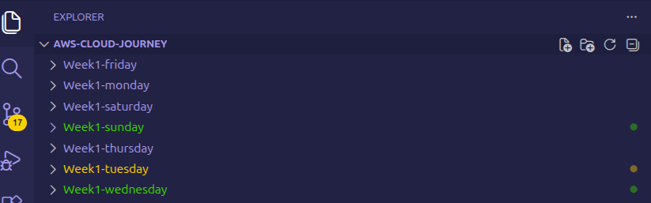
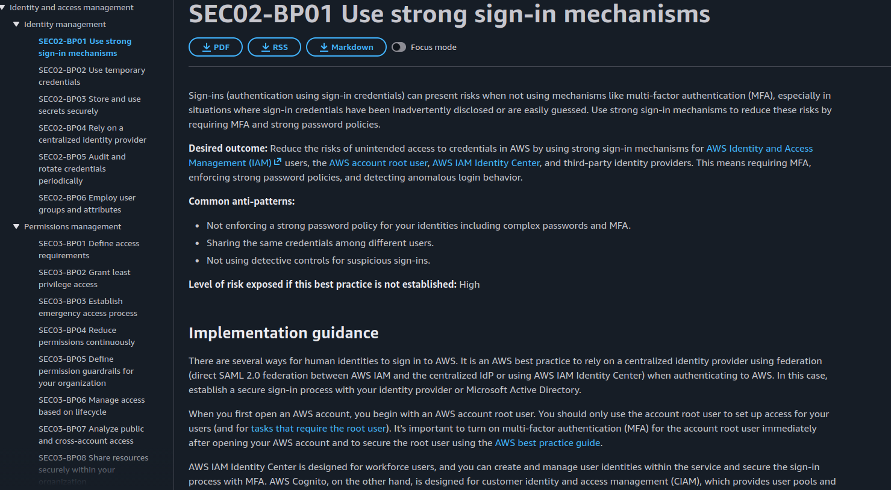
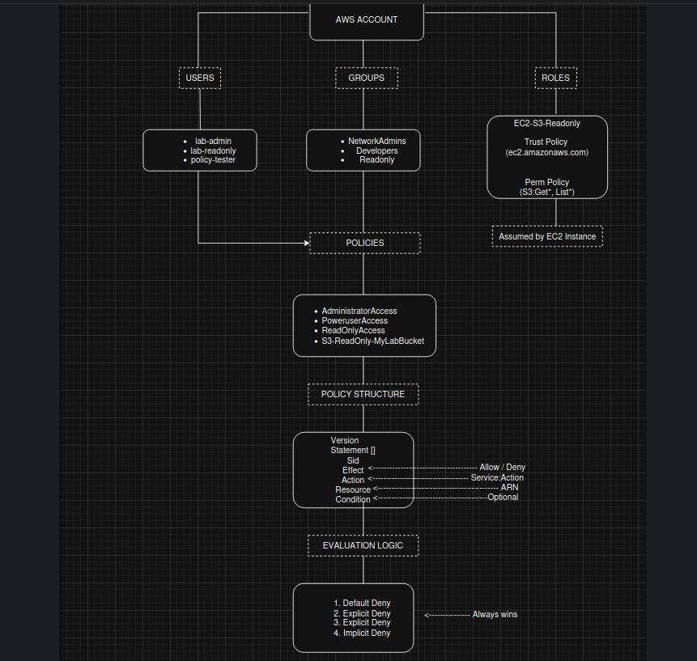
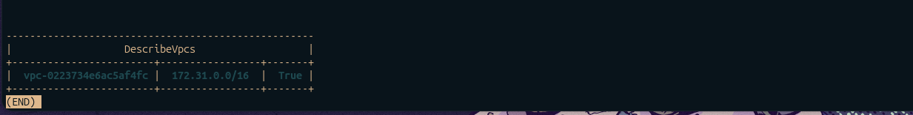

# ☁️ AWS Cloud Journey — Week 1, Day 7: Review & Well-Architected Security Reading

> **Roadmap:** AWS Cloud Networking → Cloud Network Security  
> **Phase:** 1 — Foundation  
> **Background:** Linux · CCNA Networking  
> **Date Completed:** May 2026

---

## 📋 Table of Contents

- [Overview](#overview)
- [Task 1 — Week 1 Full Review](#task-1--week-1-full-review)
- [Task 2 — AWS Well-Architected Security Pillar Reading](#task-2--aws-well-architected-security-pillar-reading)
- [Task 3 — Concept Map — IAM in One View](#task-3--concept-map--iam-in-one-view)
- [Task 4 — Week 2 Preparation](#task-4--week-2-preparation)
- [Week 1 Completion Summary](#week-1-completion-summary)
- [CCNA Bridge — Week in Review](#ccna-bridge--week-in-review)
- [Key Takeaways](#key-takeaways)
- [Whats Next](#whats-next)

---

## Overview

This is **Day 7 of Week 1** — the review and consolidation day. No new labs today. The goal was to read through everything built this week, study the AWS Well-Architected Security Pillar, build a concept map of IAM from memory, and prepare for Week 2 which moves into EC2 and Linux on AWS.

Sunday is the most important day of the week — not because of what you build, but because of what you retain.

| Item | Detail |
|---|---|
| **Week** | Week 1 |
| **Day** | Sunday |
| **Focus** | Review + Well-Architected Security Pillar |
| **Time Invested** | ~2 hours |
| **New Labs** | None |
| **Status** | All tasks completed |

---

## Task 1 — Week 1 Full Review

### What I reviewed
Went through every report from Monday to Saturday — reading the CLI commands, CCNA bridges, and key takeaways without re-doing the labs. The goal was to identify gaps and confirm what actually stuck.

### What stuck well

```
IAM policy JSON structure — Effect, Action, Resource, Condition
Explicit Deny always wins over Allow — identical to IOS ACL behaviour
Two resource ARNs needed for S3 — bucket ARN + object ARN
Roles use temporary credentials — users use permanent credentials
aws sts get-caller-identity — the first command to run every session
Named profiles in ~/.aws/credentials — keep accounts separated
Trust policy (who can assume) vs permission policy (what they can do)
```

### What needed reinforcing

**JMESPath `--query` syntax** — the filtering logic is powerful but the syntax is not natural yet. Need more repetition.

```bash
# This pattern — still need to look it up
--query 'Users[*].[UserName,CreateDate]'

# vs this — completely natural now
--query 'Users[*].UserName'
```

**`simulate-custom-policy` wrapping** — the Python one-liner to wrap the JSON file into a string array. Needed `aws help` on Saturday. Will review this weekly until it's automatic.

**Access Analyzer vs Policy Simulator** — both test policies but for different things. Writing it out clearly now:

| Tool | What it tests | When to use |
|---|---|---|
| Policy Simulator | Does this policy allow/deny this specific action? | Before attaching a new policy |
| Access Analyzer | Does anything in my account expose resources externally? | Regular security audit |
| `validate-policy` | Is this policy syntactically correct and secure? | After writing new JSON |

### Screenshot
> Replace with your actual screenshot


*All 6 daily reports open in VS Code — Week 1 complete*

---

## Task 2 — AWS Well-Architected Security Pillar Reading

### What I read
Read the [AWS Well-Architected Framework — Security Pillar](https://docs.aws.amazon.com/wellarchitected/latest/security-pillar/welcome.html) whitepaper focusing on the sections most relevant to Week 1.

### Security Design Principles Covered This Week

AWS defines 7 core security design principles. Week 1 only touched identity-related ones — the rest belong to later phases and are not claimed here.

| AWS Principle | What it means | What I did this week |
|---|---|---|
| **Implement a strong identity foundation** | Centralize identity, use least privilege, eliminate long-term credentials | Created IAM users, groups, roles — removed direct policy attachments |
| **Apply security at all layers** | Defence in depth — not just perimeter security | IAM policies as one layer of access control |
| **Automate security best practices** | Use IaC to enforce security — don't rely on manual configuration | Defined policies as JSON files — repeatable and version-controllable |
| **Keep people away from data** | Use roles and automation — reduce human access to production data | EC2 role instead of hardcoded credentials — Thursday's lab |

The remaining 3 principles — traceability, data protection, and incident readiness — are not covered yet. They map to Week 6, Phase 3, and Phase 4 respectively.

### The 6 Security Areas (Well-Architected)

```
1. Security Foundations        ← Week 1 (IAM, accounts, root MFA)
2. Identity and Access Mgmt    ← Week 1 (users, groups, roles, policies)
3. Detection                   ← Week 6 (CloudWatch, CloudTrail, GuardDuty)
4. Infrastructure Protection   ← Week 4–5 (VPC, SGs, NACLs, Network Firewall)
5. Data Protection             ← Phase 3 (KMS, ACM, encryption)
6. Incident Response           ← Phase 4 (IR runbooks, forensics)
```

Week 1 covered areas 1 and 2 completely. The roadmap follows the exact order AWS recommends — identity and access first, then detection, then infrastructure, then data, then incident response.

### Key quotes from the whitepaper that hit hard

> *"Privilege is granted based on verified identity and applied based on the principle of least privilege."*

This is exactly why we moved away from direct policy attachment on Tuesday — group-based permissions are verifiable and auditable. Direct attachments on individual users are not.

> *"Credentials must not be shared and must be rotated regularly."*

Thursday's lab on roles vs hardcoded credentials was directly applying this principle. Roles eliminate the rotation problem entirely — temporary credentials auto-expire.

### Screenshot


*AWS Well-Architected Security Pillar — Security Foundations section*

---

## Task 3 — Concept Map — IAM in One View

### What I did
Drew the complete IAM concept map from memory — no notes, no console — as a final retention check before moving to Week 2.

### IAM concept map

```
                         AWS ACCOUNT
                              │
              ┌───────────────┼───────────────┐
              │               │               │
           USERS           GROUPS           ROLES
              │               │               │
    ┌─────────┴──┐      ┌─────┴──────┐   ┌───┴────────────┐
    │ lab-admin  │      │NetworkAdmins│   │EC2-S3-ReadOnly │
    │ lab-       │      │Developers   │   │                │
    │ readonly   │      │ReadOnly     │   │ Trust Policy   │
    │ policy-    │      └─────┬──────┘   │ (ec2.amazonaws │
    │ tester     │            │          │  .com)         │
    └─────┬──────┘            │          │                │
          │                   │          │ Perm Policy    │
          │              POLICIES        │ (S3:Get*, List*)│
          │         ┌─────────┴──────┐   └───────┬────────┘
          └─────────►│ AdministratorAccess        │
                    │ PowerUserAccess │       assumed by
                    │ ReadOnlyAccess  │            │
                    │ S3-ReadOnly-    │       EC2 Instance
                    │ MyLabBucket     │
                    └─────────────────┘
                              │
                    POLICY STRUCTURE
                    ┌──────────────────┐
                    │ Version          │
                    │ Statement []     │
                    │   Sid            │
                    │   Effect         │  Allow / Deny
                    │   Action         │  service:Action
                    │   Resource       │  ARN
                    │   Condition      │  optional
                    └──────────────────┘
                              │
                    EVALUATION LOGIC
                    ┌──────────────────┐
                    │ 1. Default DENY  │
                    │ 2. Explicit DENY │ ← always wins
                    │ 3. Explicit ALLOW│
                    │ 4. Implicit DENY │
                    └──────────────────┘
```

### Screenshot



*Hand-drawn or digital IAM concept map — full week in one view*

---

## Task 4 — Week 2 Preparation

### What I did
Read through the Week 2 plan — EC2 and Linux on AWS — and made sure my environment is ready before Monday.

### Week 2 checklist

```bash
# Verify AWS CLI still authenticated
aws sts get-caller-identity --profile lab

# Verify free tier is still active — check billing dashboard
aws ce get-cost-and-usage \
  --time-period Start=2026-05-01,End=2026-05-31 \
  --granularity MONTHLY \
  --metrics BlendedCost \
  --profile lab

# Check default VPC exists (needed for Week 2 EC2 launch)
aws ec2 describe-vpcs \
  --filters Name=isDefault,Values=true \
  --query 'Vpcs[*].[VpcId,CidrBlock,IsDefault]' \
  --output table \
  --profile lab

# Confirm key pair doesn't already exist (will create fresh Monday)
aws ec2 describe-key-pairs \
  --output table \
  --profile lab
```

### What Week 2 covers

| Day | Focus | CCNA Bridge |
|---|---|---|
| Monday | Launch first EC2 + SSH with key pair | 2911 console cable → key pair SSH |
| Tuesday | Security Groups — inbound/outbound rules | Extended ACL per interface |
| Wednesday | User data scripts — auto-provision on boot | IOS EEM applet / startup config |
| Thursday | EBS volumes — attach, format, mount | External flash storage on router |
| Friday | SCP and rsync — file transfer to EC2 | TFTP/SCP config backup on IOS |
| Saturday | Full EC2 lab rebuild from scratch | Saturday CCNA topology rebuild |
| Sunday | Review + EC2 pricing and cost awareness | N/A |

### What to have ready for Monday

```bash
# 1. AWS CLI authenticated
aws sts get-caller-identity --profile lab  # confirm working

# 2. Know the AMI ID for Amazon Linux 2 in your region
aws ec2 describe-images \
  --owners amazon \
  --filters "Name=name,Values=amzn2-ami-hvm-*-x86_64-gp2" \
  --query 'sort_by(Images,&CreationDate)[-1].[ImageId,Name]' \
  --output table \
  --profile lab

# 3. Confirm billing alert is set
aws budgets describe-budgets \
  --account-id 695331051020 \
  --profile lab
```

### Screenshot


*aws ec2 describe-vpcs confirming default VPC exists — ready for Week 2*

---

## Week 1 Completion Summary

### What was built this week

| Day | Topic | Completed |
|---|---|---|
| Monday | AWS account + MFA + billing alert + console exploration | ✅ |
| Tuesday | IAM users, groups, policy attachment | ✅ |
| Wednesday | Custom IAM policy JSON + Policy Simulator | ✅ |
| Thursday | IAM roles, trust policies, EC2 role attachment | ✅ |
| Friday | AWS CLI v2 + named profiles + CLI commands | ✅ |
| Saturday | Full IAM rebuild from scratch — CLI only, 2H38 minutes | ✅ |
| Sunday | Well-Architected review + concept map + Week 2 prep | ✅ |

### AWS resources created this week

```
IAM Users:    lab-admin, lab-readonly, policy-tester
IAM Groups:   NetworkAdmins, Developers, ReadOnly
IAM Policies: S3-ReadOnly-MyLabBucket (custom)
IAM Roles:    EC2-S3-ReadOnly-Role
S3 Buckets:   my-lab-bucket
CLI Profiles: lab, readonly
Root MFA:     Enabled
Billing Alert: $5 threshold — active
```

### Certification progress

**AWS Cloud Practitioner** — the Week 8 target. Topics covered so far:

```
IAM (users, groups, roles, policies)    ████████░░  80%
Billing & cost management               ████░░░░░░  40%
S3 basics                               ██░░░░░░░░  20%
EC2 basics                              ░░░░░░░░░░   0% ← Week 2
VPC basics                              ░░░░░░░░░░   0% ← Week 4
```

---

## CCNA Bridge — Week in Review

Looking back at the full week, every single IAM concept had a networking equivalent:

| IAM Concept | CCNA Equivalent | Lesson |
|---|---|---|
| IAM User | Local user on 2911 (`username admin`) | Permanent identity with credentials |
| IAM Group | Privilege level shared across users | Bulk permission management |
| IAM Role | TACACS+ delegated auth | Temporary, no permanent credentials |
| IAM Policy | Extended named ACL | Allow/deny rules with conditions |
| Trust Policy | `aaa authentication` trust | Who is allowed to authenticate |
| Implicit Deny | `deny ip any any` at end of ACL | Default block everything |
| Explicit Deny | `deny` statement in ACL | Overrides any permit |
| Policy Simulator | `show ip access-lists` before applying | Test before deploying |
| MFA on root | Physical console access only for emergency | Protect the highest privilege |

The translation was cleaner than expected. The hardest part of Week 1 was not the concepts — it was the JSON syntax and CLI flags. Both become natural with repetition.

---

## Key Takeaways

```
Week 1 is complete — IAM is the security backbone of everything that follows
The 7 Well-Architected Security Principles are the framework behind every lab decision
Identity first, then detection, then infrastructure, then data, then incident response
JMESPath --query syntax needs deliberate practice — review weekly
Roles over credentials is not just best practice — it is the architecture pattern
Every action taken in AWS is an API call — IAM controls every single one
Week 2 starts fresh — EC2, key pairs, security groups, Linux on the cloud
```

### Reflection on Week 1

IAM is unglamorous. There are no topology diagrams, no traffic flowing through interfaces, no ping tests. But every single thing that will be built for the rest of this roadmap — EC2, VPC, NAT, Firewall, GuardDuty, VPN — runs on top of the IAM foundation built this week. Getting IAM wrong means every future layer is insecure. Getting it right means every future layer starts from a solid base.

Week 1 done. Week 2 starts Monday.

---

## Whats Next

| Week | Focus |
|---|---|
| **Week 2** | EC2 & Linux on AWS — launch, SSH, security groups, EBS, SCP |
| **Week 3** | S3 deep dive — permissions, versioning, lifecycle, encryption |
| **Week 4** | VPC fundamentals — custom VPC, subnets, routing, NACLs |

---

## Resources Used

- [AWS Well-Architected Security Pillar](https://docs.aws.amazon.com/wellarchitected/latest/security-pillar/welcome.html)
- [AWS IAM Best Practices](https://docs.aws.amazon.com/IAM/latest/UserGuide/best-practices.html)
- [AWS Security Blog](https://aws.amazon.com/blogs/security/)
- [JMESPath Tutorial](https://jmespath.org/tutorial.html)

---

## Screenshots Folder Structure

```
Week1-sunday/
├── screenshorts/
│   ├── 01_week1_reports.png
│   ├── 02_well_architected.png
│   ├── 03_iam_concept_map.png
│   └── 04_week2_prep.png
└── week1_sunday_review.md
```

> **Tip:** Sunday has the fewest screenshots — 4 slots. The concept map screenshot is the most valuable one for the portfolio.

---

*Part of my AWS Cloud Networking roadmap — from Linux & CCNA background to Cloud Network Security Engineer.*  
*Follow along as I document each week of labs and learning.*
