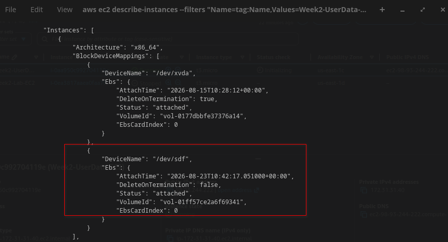
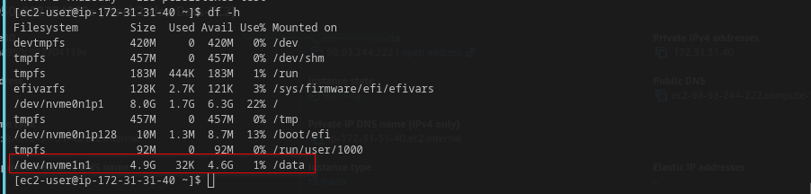
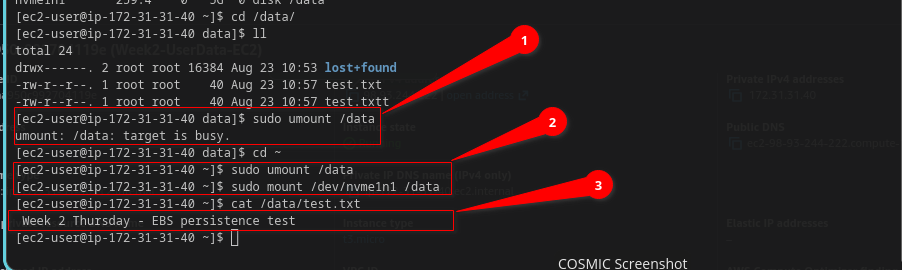
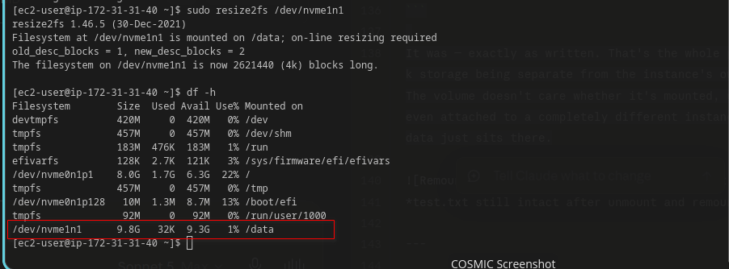

# ☁️ AWS Cloud Journey — Week 2, Day 4: EBS Volumes

> **Roadmap:** AWS Cloud Networking → Cloud Network Security  
> **Phase:** 1 — Foundation  
> **Background:** Linux · CCNA Networking  
> **Date Completed:** August 2026

---
## 📋 Table of Contents
 
- [Task 1 — Attach a New EBS Volume to EC2](#task-1--attach-a-new-ebs-volume-to-ec2)
- [Task 2 — Format and Mount the Volume](#task-2--format-and-mount-the-volume)
- [Task 3 — Write Files, Unmount, Remount](#task-3--write-files-unmount-remount)
- [Task 4 — Extend Volume Size and Resize the Filesystem](#task-4--extend-volume-size-and-resize-the-filesystem)
- [CCNA Bridge](#ccna-bridge)
- [Key Takeaways](#key-takeaways)
- [Whats Next](#whats-next)

---

Today was supposed to be a quiet one — attach a disk, format it, mount it, done. It mostly was, except AWS threw one genuine "wait, what?" moment at me that I didn't see coming, and it turned into the most useful thing I learned all week.
 
Still using the same instance from yesterday (`Week2-UserData-EC2`, the one running Apache off the user data script). No reason to spin up a new one just to attach a disk to it.
 
| Item | Detail |
|---|---|
| **Week** | Week 2 |
| **Day** | Thursday |
| **Focus** | EBS volumes — attach, format, mount, resize |
| **Time Invested** | ~1.5 hours |
| **Status** | All tasks completed |
 
---

## Task 1 — Attach a New EBS Volume to EC2
 
EBS volumes are locked to a specific Availability Zone, so before creating anything I had to check where my instance actually lives — you can't attach a volume from `us-east-1b` to an instance sitting in `us-east-1a`.
 
```bash
aws ec2 describe-instances \
  --filters "Name=tag:Name,Values=Week2-UserData-EC2" \
  --profile lab
```
 
Found it — `us-east-1c`. Created a small 5GB `gp3` volume in that same zone:
 
```bash
aws ec2 create-volume \
  --availability-zone us-east-1a \
  --size 5 \
  --volume-type gp3 \
  --tag-specifications 'ResourceType=volume,Tags=[{Key=Name,Value=Week2-Data-Volume}]' \
  --profile lab
```
 
Got back a `VolumeId` — something like `vol-0abc123def456789`. Then attached it:
 
```bash
aws ec2 attach-volume \
  --volume-id vol-0abc123def456789 \
  --instance-id i-0abc123def456789 \
  --device /dev/sdf \
  --profile lab
```
 
5GB is nothing to worry about cost-wise — the free tier covers 30GB of EBS storage a month, and my root volume is only 8GB, so I'm nowhere close to any limit.
 



*create-volume and attach-volume output — VolumeId and attachment confirmed*
---

## Task 2 — Format and Mount the Volume
 
SSHed in, ran `lsblk` expecting to see `/dev/sdf` — the exact name I'd just told AWS to use. Instead:
 
```bash
lsblk

NAME        MAJ:MIN RM SIZE RO TYPE MOUNTPOINT
nvme0n1     259:0    0   8G  0 disk
└─nvme0n1p1 259:1    0   8G  0 part /
nvme1n1     259:2    0   5G  0 disk
```
 
No `sdf` anywhere. Turns out `t3.micro` runs on the Nitro hypervisor, and Nitro instances expose EBS volumes as NVMe devices no matter what device name you request in the `attach-volume` call. AWS quietly remaps it — `/dev/sdf` becomes `/dev/nvme1n1`. The name you ask for is basically a suggestion at this point, not a guarantee. Good thing to learn now, in a lab, rather than mid-panic during a real deployment when a script expects `/dev/xvdf` and it's nowhere to be found.
 
With the real device name sorted out, formatting and mounting was the easy part:
 
```bash
# Format it — ext4, nothing fancy
sudo mkfs -t ext4 /dev/nvme1n1
 
# Make a mount point and mount it
sudo mkdir /data
sudo mount /dev/nvme1n1 /data
 
# Confirm it's there
df -h
```
 
`df -h` showed the new 5GB volume mounted at `/data`.
 



*df -h showing the 5GB volume mounted at /data, test file written*

---
 
## Task 3 — Write Files, Unmount, Remount
 
This is the part that matters conceptually — EBS is supposed to be *persistent* block storage, meaning the data survives independently of any single mount. Wanted to actually prove that instead of just trusting the marketing copy.
 
```bash
echo "Week 2 Thursday - EBS persistence test" | sudo tee /data/test.txt
cat /data/test.txt
```
 
Then unmounted it:
 
```bash
cd ~
sudo umount /data
```
 
Quick note: I first tried unmounting while I was still `cd`'d into `/data` and got hit with `target is busy`. Small dumb mistake, but a real one — Linux won't let you unmount a filesystem while something (even just your shell's current directory) is sitting inside it. `cd ~` first, then unmount.
 
```bash
# Remount it
sudo mount /dev/nvme1n1 /data
 
# Is the file still there?
cat /data/test.txt
```
 
It was — exactly as written. That's the whole point of block storage being separate from the instance's own lifecycle. The volume doesn't care whether it's mounted, unmounted, or even attached to a completely different instance later. The data just sits there.





*test.txt still intact after unmount and remount*

---
## Task 4 — Extend Volume Size and Resize the Filesystem
 
Decided 5GB felt small for no real reason other than wanting to see the resize process actually work. Bumped it to 10GB:
 
```bash
aws ec2 modify-volume \
  --volume-id vol-0abc123def456789 \
  --size 10 \
  --profile lab
```
 
Checked on the modification status until it settled:
 
```bash
aws ec2 describe-volumes-modifications \
  --volume-ids vol-0abc123def456789 \
  --profile lab
```
 
Waited until `ModificationState` showed `completed`, then back on the instance:
 
```bash
lsblk
df -h
```
 
AWS-side, the volume is now 10GB, and `lsblk` picked that up immediately — no rescan command, no reboot, the block device just showed `10G` right away. But that's only the raw device size. The **filesystem** sitting on top of it is a separate thing entirely, and that's what `df -h` measures, not `lsblk`. Running `df -h` at this point still showed the ext4 filesystem capped at roughly 5GB — the disk got bigger, but nothing told the filesystem it was allowed to actually use the new space yet.
 
Since I formatted the raw device directly instead of creating a partition table first, growing the filesystem was just one command — no `growpart` needed:
 
```bash
sudo resize2fs /dev/nvme1n1
df -h
```
 
`df -h` now showed the full 10GB. No reboot, no downtime, no unmounting required for any of this. Genuinely didn't expect that — I assumed resizing a disk would need at least a restart.
 
One thing worth remembering: AWS won't let you modify the same volume's size again for a while after a change, so it's worth actually deciding on a size instead of bumping it up repeatedly to test.





*df -h confirming the filesystem now shows the full 10GB after resize2fs*

---

## Where this lines up with CCNA

There isn't a perfect one-to-one here, but the closest thing I can compare it to is adding external flash storage to a router — like inserting a CompactFlash card or a USB drive into a 2911 to expand available storage beyond what's built in.

| Cisco 2911 | EBS Equivalent |
|---|---|
| Insert CompactFlash / USB storage | `attach-volume` |
| `show flash:` (see what's mounted) | `lsblk` / `df -h` |
| Format the flash card before use | `mkfs -t ext4` |
| Flash storage persists even if you pull it and reinsert it elsewhere | EBS volume persists independently of the instance it's attached to |
| No live resize — you'd need bigger physical media | `modify-volume` + `resize2fs` — resize live, no swap needed |

That last row is really the whole story of why cloud storage is a different category of tool entirely. On physical hardware, "I need more space" means buying bigger media and physically swapping it. Here it's two commands and thirty seconds.

---

## Key Takeaways
 
Honestly today's biggest lesson wasn't really about EBS mechanics — it was the reminder that AWS abstracts things in ways that look simple from the API but hide real detail underneath. Asking for `/dev/sdf` and getting `/dev/nvme1n1` is a small thing, but it's exactly the kind of gap between "what you asked for" and "what actually happened" that'll bite you later if you're not paying attention. Same goes for `lsblk` vs `df -h` — two commands that look like they'd tell you the same thing, but actually report on two completely different layers of the storage stack.
 
```
Nitro instances remap device names — /dev/sdf on request, /dev/nvme1n1 in reality
lsblk shows the block device size — updates automatically after a resize
df -h shows the filesystem size — stays capped until resize2fs runs
cd out of a mount point before unmounting it, or you'll get "target is busy"
No downtime needed for any of this — no reboot, no unmount required to resize
```
 
---
 
## Whats Next
 
**Tomorrow:** SCP and rsync — actually getting files onto and off of this instance properly instead of just `echo`-ing test strings into it.
 
---

### Resources
- [Amazon EBS Volumes Documentation](https://docs.aws.amazon.com/AWSEC2/latest/UserGuide/ebs-volumes.html)
- [Nitro Instance NVMe Device Naming](https://docs.aws.amazon.com/AWSEC2/latest/UserGuide/nvme-ebs-volumes.html)
- [Modifying an EBS Volume](https://docs.aws.amazon.com/AWSEC2/latest/UserGuide/requesting-ebs-volume-modifications.html)

### Screenshots folder
```
Week2-thursday/
├── screenshorts/
│   ├── 01_volume_attached.png
│   ├── 02_mounted_formatted.png
│   ├── 03_remount_test.png
│   └── 04_volume_resized.png
└── week2_thursday_ebs_volumes.md
```
> **Tip:** Same `screenshorts/` naming pattern — relative paths, push alongside the `.md` file.
---

*Part of my AWS Cloud Networking roadmap — from Linux & CCNA background to Cloud Network Security Engineer.*
