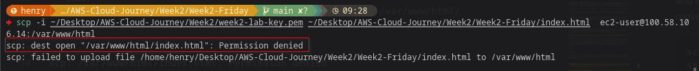
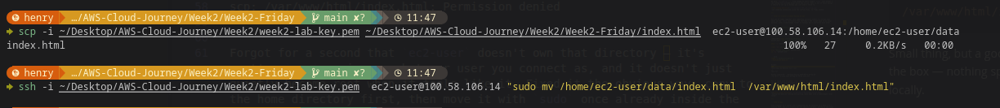
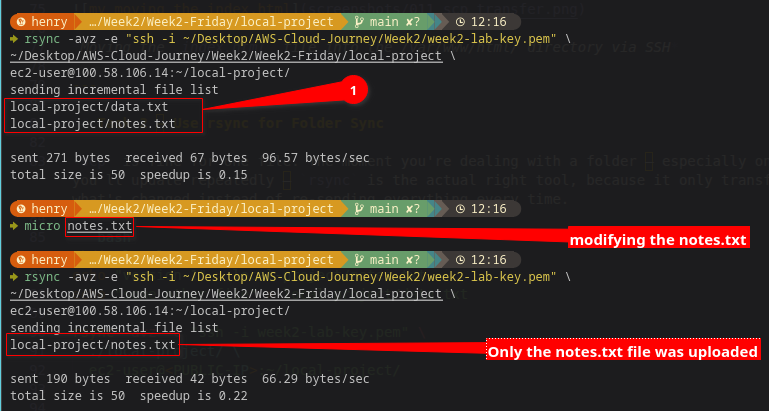
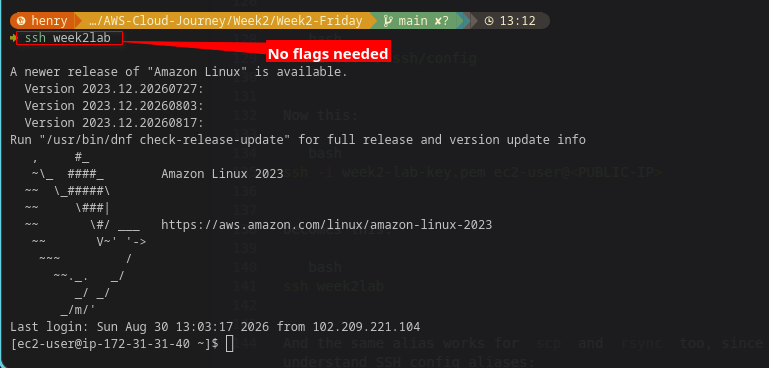
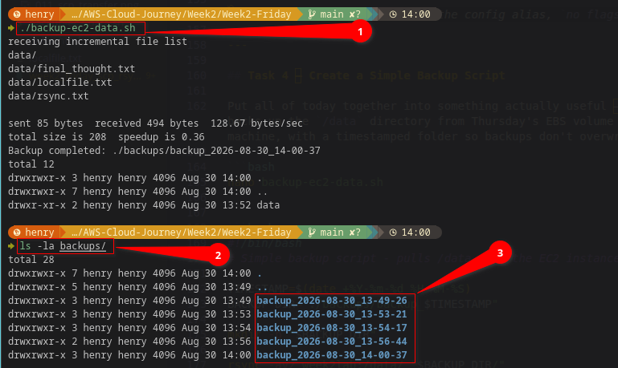

# ☁️ AWS Cloud Journey — Week 2, Day 5: SCP, rsync & File Transfer

> **Roadmap:** AWS Cloud Networking → Cloud Network Security  
> **Phase:** 1 — Foundation  
> **Background:** Linux · CCNA Networking  
> **Date Completed:** August 2026

---

## 📋 Table of Contents

- [Task 1 — Copy a File from Local to EC2 with SCP](#task-1--copy-a-file-from-local-to-ec2-with-scp)
- [Task 2 — Use rsync for Folder Sync](#task-2--use-rsync-for-folder-sync)
- [Task 3 — Set Up an SSH Config File for a Shortcut](#task-3--set-up-an-ssh-config-file-for-a-shortcut)
- [Task 4 — Create a Simple Backup Script](#task-4--create-a-simple-backup-script)
- [CCNA Bridge](#ccna-bridge)
- [Key Takeaways](#key-takeaways)
- [Whats Next](#whats-next)

---

Nice change of pace today. No IAM policy edge cases, no AWS renaming my devices behind my back — just plain Linux file transfer, which is territory I actually feel at home in already. Felt less like learning something new and more like finally getting to use skills I already had, just pointed at an EC2 instance instead of a physical box.

| Item | Detail |
|---|---|
| **Week** | Week 2 |
| **Day** | Friday |
| **Focus** | SCP, rsync, SSH config shortcuts, backup scripting |
| **Time Invested** | ~2 hour |
| **Status** | All tasks completed |

---

## Task 1 — Copy a File from Local to EC2 with SCP

Made a throwaway test file locally and pushed it to the instance:

```bash
echo "hello from local machine - $(date)" > localfile.txt

scp -i week2-lab-key.pem localfile.txt ec2-user@<PUBLIC-IP>:~/
```

Straightforward. SSHed in to confirm it landed:

```bash
ssh -i week2-lab-key.pem ec2-user@<PUBLIC-IP>
cat ~/localfile.txt
```

There it was. The one thing that tripped me up — out of habit — was trying to `scp` a new `index.html` straight into `/var/www/html/` to replace the one the user data script generated on Wednesday:

```bash
scp -i week2-lab-key.pem index.html ec2-user@<PUBLIC-IP>:/var/www/html/
```

```
scp: /var/www/html/index.html: Permission denied
```

Forgot for a second that `ec2-user` doesn't own that directory — it's root's. `scp` copies as whatever user you connect as, and it doesn't just quietly become root when it feels like it. Fixed it the obvious way: copy to the home directory first, then move it with `sudo` once already inside the instance.

```bash
scp -i week2-lab-key.pem index.html ec2-user@<PUBLIC-IP>:~/
ssh -i week2-lab-key.pem ec2-user@<PUBLIC-IP> "sudo mv ~/index.html /var/www/html/index.html"
```

Small thing, but a good reminder that file transfer permissions follow the same rules as everything else on the box — nothing special happens just because the file arrived over the network instead of being typed locally.



*scp copying a file to the instance, and the permission denied moment when trying to write directly to `/var/www/html`*




*Moving the `index.html` file into the /var/www/html/ directory via SSH*

---

## Task 2 — Use rsync for Folder Sync

`scp` is fine for one file. The moment you're dealing with a folder — especially one you'll update repeatedly — `rsync` is the actual right tool, because it only transfers what's changed instead of re-sending everything every time.

```bash
mkdir local-project
echo "version 1" > local-project/notes.txt
echo "some other file" > local-project/data.txt

rsync -avz -e "ssh -i week2-lab-key.pem" \
  ./local-project/ \
  ec2-user@<PUBLIC-IP>:~/local-project/
```

`-a` keeps permissions and timestamps intact, `-v` so I can actually see what's happening, `-z` compresses during transfer. First run copied both files, as expected.

Then I changed one line in `notes.txt` and ran the exact same command again:

```bash
echo "version 2 - updated" > local-project/notes.txt
rsync -avz -e "ssh -i week2-lab-key.pem" \
  ./local-project/ \
  ec2-user@<PUBLIC-IP>:~/local-project/
```

Only `notes.txt` showed up in the transfer output. `data.txt` didn't move at all, because nothing about it had changed. That's the actual point of `rsync` over `scp` — for anything beyond a single one-off file, this is the only sane option. Watching it skip the unchanged file was oddly satisfying.


*rsync transferring only the changed file on the second run*

---

## Task 3 — Set Up an SSH Config File for a Shortcut

By this point I'd typed `ssh -i week2-lab-key.pem ec2-user@<PUBLIC-IP>` so many times this week that it stopped feeling like a command and started feeling like a chore. Fixed that with an SSH config entry.

```bash
nano ~/.ssh/config
```

```
Host week2lab
    HostName <PUBLIC-IP>
    User ec2-user
    IdentityFile ~/week2-lab-key.pem
```

```bash
chmod 600 ~/.ssh/config
```

Now this:

```bash
ssh -i week2-lab-key.pem ec2-user@<PUBLIC-IP>
```

becomes this:

```bash
ssh week2lab
```

And the same alias works for `scp` and `rsync` too, since they both understand SSH config aliases:

```bash
scp localfile.txt week2lab:~/
rsync -avz ./local-project/ week2lab:~/local-project/
```

No more `-e "ssh -i ..."` flag needed on every single `rsync` call either — the config file already knows which key to use. This is one of those things I should've set up on Monday and just didn't think to.




*ssh week2lab connecting using the config alias, `no flags needed`*

---

## Task 4 — Create a Simple Backup Script

Put all of today together into something actually useful — a script that backs up the `/data` directory from Thursday's EBS volume down to my local machine, with a timestamped folder so backups don't overwrite each other.

```bash
nano backup-ec2-data.sh
```

```bash
#!/bin/bash
# Simple backup script - pulls /data from the EC2 instance to local machine

TIMESTAMP=$(date +%Y-%m-%d_%H-%M-%S)
BACKUP_DIR="./backups/backup_$TIMESTAMP"

mkdir -p "$BACKUP_DIR"

rsync -avz week2lab:/data/ "$BACKUP_DIR/"

echo "Backup completed: $BACKUP_DIR"
ls -la "$BACKUP_DIR"
```

```bash
chmod +x backup-ec2-data.sh
./backup-ec2-data.sh
```

Output:
```
receiving incremental file list

data/
data/final_thought.txt
data/localfile.txt
data/rsync.txt

Backup completed: ./backups/backup_2026-08-30_14-00-37
total 12
drwxrwxr-x 3 henry henry 4096 Aug 30 14:00 .
drwxrwxr-x 7 henry henry 4096 Aug 30 14:00 ..
drwxr-xr-x 2 henry henry 4096 Aug 30 13:52 data
```

Ran it twice just to watch `rsync` behave the same way it did in Task 2 — the second run only re-copies if something on the instance actually changed. This is the first script this week that I'd actually want to keep and reuse, not just something built to prove a concept. Wiring this to `cron` for a nightly backup feels like an obvious next step, even if it's not part of today's task list.




*`backup-ec2-data.sh` running and pulling `/data` down into a timestamped local folder*

---

## CCNA Bridge

File transfer to a router isn't something you do casually on a 2911 — it's usually TFTP, and it's usually for one specific purpose: moving an IOS image or a config file. SSH-based transfer to a Linux box is a much more general-purpose tool, but the underlying concern is the same: get a file from one place to another, reliably, and know it arrived intact.

| Cisco 2911 | SSH-based Equivalent |
|---|---|
| `copy tftp: flash:` (pull an IOS image) | `scp` (push or pull any file) |
| TFTP server needed just to move one file | No separate server — SSH already does the job |
| No concept of "only copy what changed" | `rsync` — delta transfer, only changed files move |
| Re-typing the TFTP server IP every time | SSH config `Host` alias — type it once |
| `copy running-config tftp:` for backups | `backup-ec2-data.sh` — same idea, actually scriptable |

**The real difference:** TFTP on a 2911 is a narrow tool for a narrow job — firmware and configs, nothing else, no compression, no encryption. SSH-based transfer is genuinely general-purpose, and once wrapped in a script, becomes real infrastructure rather than a one-off manual task.

---

## Key Takeaways

Nothing here was conceptually hard — this is the first day this week that felt like coasting on existing Linux knowledge rather than learning something new about AWS specifically. Which honestly was a nice break after Thursday's `nvme` surprise.

```
scp works fine for single files — permissions still apply exactly like local file operations
Can't scp directly into root-owned directories as ec2-user — copy to home, then sudo mv
rsync only transfers what's changed — the right tool for folders and repeat transfers
SSH config aliases eliminate retyping -i flags and IPs — should've done this Monday
scp and rsync both understand SSH config Host aliases, not just the ssh command itself
A working backup script beats a one-off command — this one's actually going in my toolkit
```

---

## Whats Next

**Tomorrow:** the Saturday rebuild — EC2, security groups, user data, EBS, and today's file transfer setup, all from scratch, CLI only, no notes open. Same drill as Week 1's IAM rebuild.

---

### Resources
- [scp Command Reference](https://man7.org/linux/man-pages/man1/scp.1.html)
- [rsync Documentation](https://linux.die.net/man/1/rsync)
- [SSH Config File Reference](https://man.openbsd.org/ssh_config)

### Screenshots Folder Structure
```
Week2-friday/
├── screenshorts/
│   ├── 01_scp_transfer.png
|   ├── 011_scp_transfer.png
│   ├── 02_rsync_sync.png
│   ├── 03_ssh_config.png
│   └── 04_backup_script.png
├── backup-ec2-data.sh
└── week2_friday_scp_rsync.md
```

---

*Part of my AWS Cloud Networking roadmap — from Linux & CCNA background to Cloud Network Security Engineer.*
