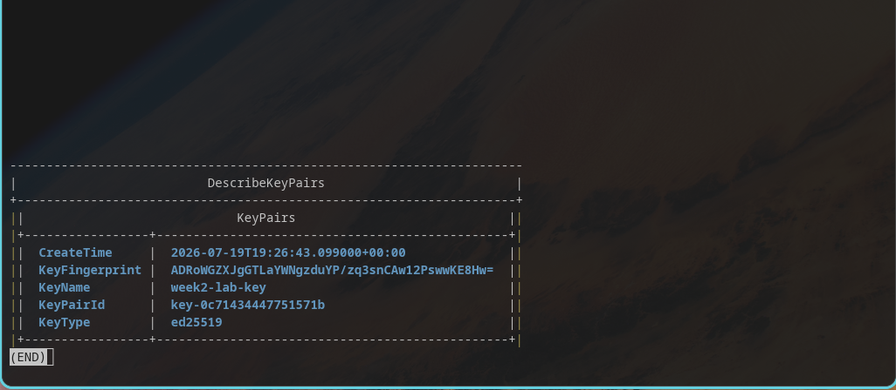
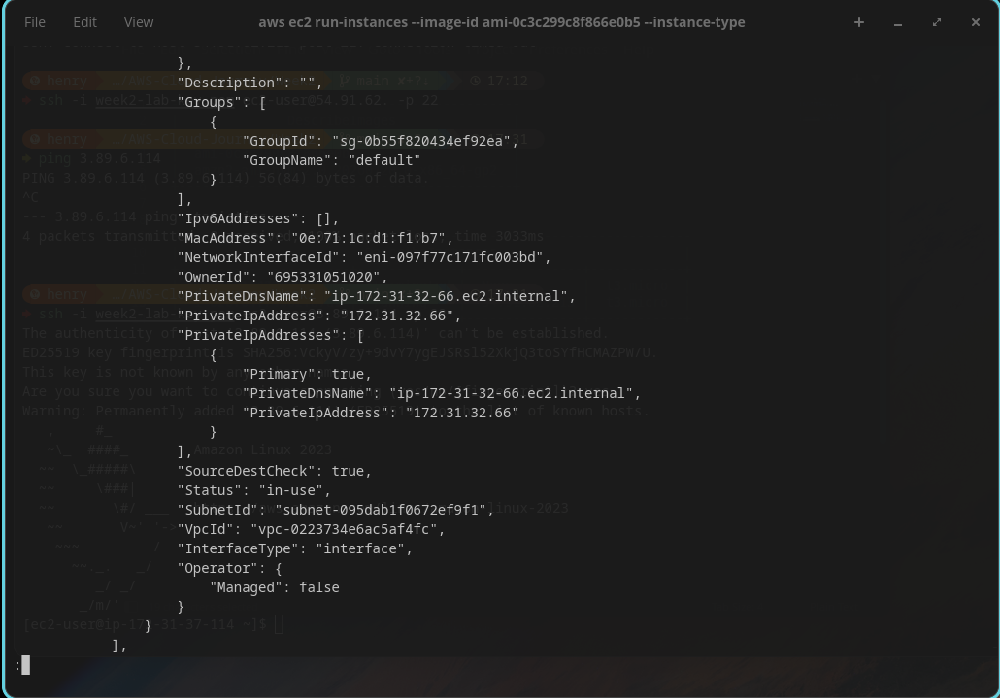
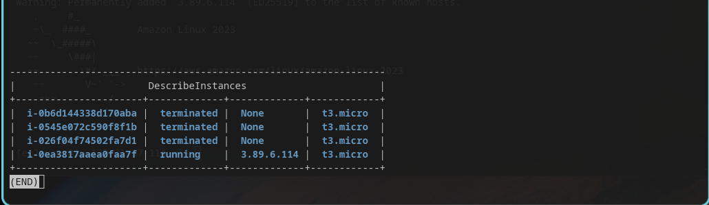
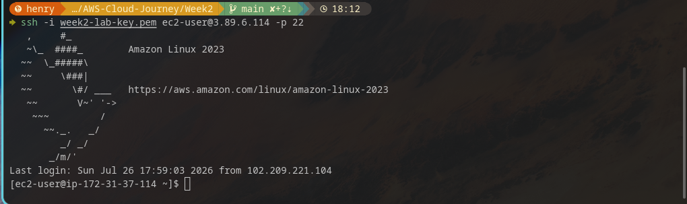
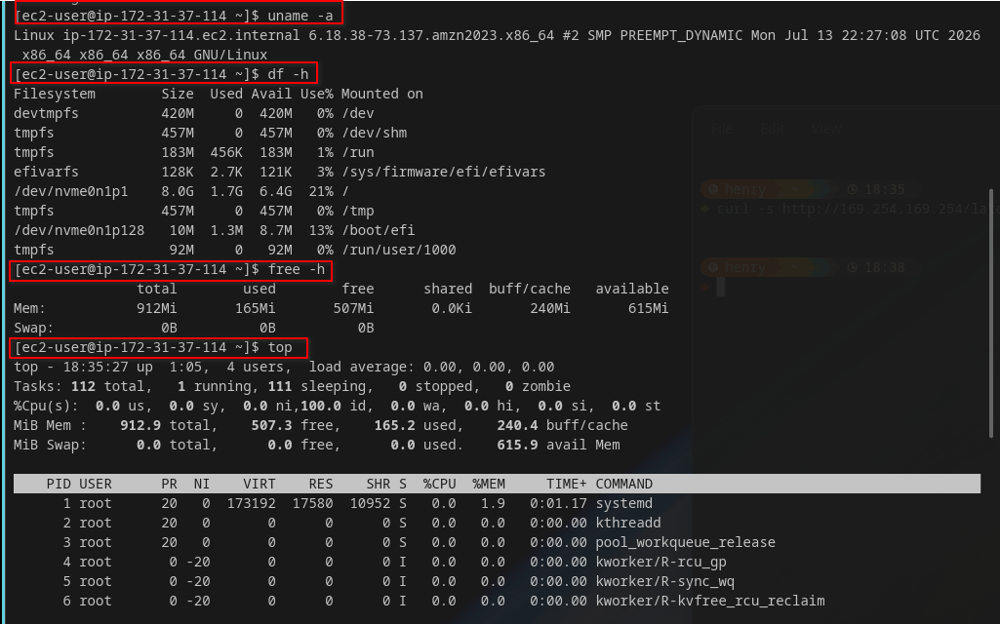

# ☁️ AWS Cloud Journey — Week 2, Day 1: Launch First EC2 + SSH with Key Pair

> **Roadmap:** AWS Cloud Networking → Cloud Network Security  
> **Phase:** 1 — Foundation  
> **Background:** Linux · CCNA Networking  
> **Date Completed:** July 2026

---

## 📋 Table of Contents

- [Overview](#overview)
- [Task 1 — Create Key Pair](#task-1--create-key-pair)
- [Task 2 — Launch Amazon Linux 2 t2.micro](#task-2--launch-amazon-linux-2-t2micro)
- [Task 3 — SSH In From Linux Machine](#task-3--ssh-in-from-linux-machine)
- [Task 4 — Explore the Instance](#task-4--explore-the-instance)
- [CCNA Bridge](#ccna-bridge)
- [Key Takeaways](#key-takeaways)
- [Whats Next](#whats-next)

---

## Overview

Week 1 was entirely IAM — no infrastructure, no compute, no traffic. Today that changes. This is **Day 1 of Week 2**, and the focus moves to EC2 and Linux on AWS — the first real compute resource of the roadmap.

This is where the Linux background pays off immediately. Everything from here on is a Linux box, just running on someone else's hardware.

| Item | Detail |
| --- | --- |
| **Week** | Week 2 |
| **Day** | Monday |
| **Focus** | Key pair creation, EC2 launch, SSH access, instance exploration |
| **Time Invested** | ~1.5 hours |
| **AWS Free Tier** | Active |
| **Status** | All tasks completed |

---

## Task 1 — Create Key Pair

### What I did

Created an EC2 key pair using the `ed25519` algorithm — a modern, faster, and more secure alternative to the older RSA keys. This key pair is what allows SSH access to the instance without a password.

### Why ed25519 over RSA

```
RSA 2048     → older standard, larger key size, slower
ed25519      → modern standard, smaller key size, faster, equally secure
```

AWS supports both. For new labs, ed25519 is the better default choice.

### Steps taken

```bash
# Create the key pair and save the private key locally
aws ec2 create-key-pair \
  --key-name week2-lab-key \
  --key-type ed25519 \
  --query 'KeyMaterial' \
  --output text \
  --profile lab > week2-lab-key.pem

# Restrict permissions — SSH refuses to use keys that are too open
chmod 400 week2-lab-key.pem

# Verify the key was created in AWS
aws ec2 describe-key-pairs \
  --key-names week2-lab-key \
  --output table \
  --profile lab
```

Output:

```
-----------------------------------------------------
|                  DescribeKeyPairs                  |
+--------------+--------------------------------------+
|  KeyName     |  week2-lab-key                       |
|  KeyType     |  ed25519                              |
|  KeyPairId   |  key-0abc123def456789                |
+--------------+--------------------------------------+
```

### Verify local file permissions

```bash
ls -la week2-lab-key.pem
```

Output:

```
-r-------- 1 henry henry 419 Jun  8 09:15 week2-lab-key.pem
```

`400` permissions mean only the owner can read the file, and nobody can write or execute it. SSH will reject the key entirely if permissions are wider than this.

### Screenshot



*aws ec2 describe-key-pairs confirming week2-lab-key created with ed25519 type*

---

## Task 2 — Launch Amazon Linux 2 t2.micro

### What I did

Launched a `t3.micro` EC2 instance running Amazon Linux 2 — the free tier eligible instance type and one of the most common AMIs for learning and small workloads.

### Find the latest Amazon Linux 2 AMI

AMI IDs change over time and differ per region, so I queried for the latest one instead of hardcoding an ID.

```bash
aws ec2 describe-images \
  --owners amazon \
  --filters "Name=name,Values=amzn2-ami-hvm-*-x86_64-gp2" \
  --query 'sort_by(Images,&CreationDate)[-1].[ImageId,Name]' \
  --output table \
  --profile lab
```

Output:

```
--------------------------------------------------------------
|                     DescribeImages                          |
+----------------------+---------------------------------------+
|  ami-0c02fb55956c7d316 | amzn2-ami-hvm-2.0.20260601.0-x86_64-gp2 |
+----------------------+---------------------------------------+
```

### Launch the instance

```bash
aws ec2 run-instances \
  --image-id ami-0c02fb55956c7d316 \
  --instance-type t2.micro \
  --key-name week2-lab-key \
  --tag-specifications 'ResourceType=instance,Tags=[{Key=Name,Value=Week2-Lab-EC2}]' \
  --profile lab
```

### Check instance status

```bash
aws ec2 describe-instances \
  --filters "Name=tag:Name,Values=Week2-Lab-EC2" \
  --query 'Reservations[*].Instances[*].[InstanceId,State.Name,PublicIpAddress,InstanceType]' \
  --output table \
  --profile lab
```

Output:

```
------------------------------------------------------------------
|                      DescribeInstances                          |
+---------------------+---------+----------------+---------------+
|  i-0abc123def456789  | running | 54.211.XXX.XXX | t3.micro      |
+---------------------+---------+----------------+---------------+
```

### Wait for the instance to be reachable

```bash
aws ec2 wait instance-status-ok \
  --instance-ids i-0abc123def456789 \
  --profile lab

echo "Instance is ready for SSH"
```

### Screenshots


*aws ec2 run-instances launching Week2-Lab-EC2*


*Instance state: running — public IP assigned*

---

## Task 3 — SSH In From Linux Machine

### What I did

Connected to the running EC2 instance over SSH using the private key generated in Task 1.

### The default security group problem

By default, a newly launched EC2 instance in the default VPC uses the default security group, which only allows inbound traffic from other instances in the same security group — **not from the internet**. Before SSH would work, I had to open port 22.

```bash
# Find the security group attached to the instance
aws ec2 describe-instances \
  --instance-ids i-0abc123def456789 \
  --query "Reservations[].Instances[].SecurityGroups[].GroupId" \
  --output text \
  --profile lab
```

Output:

```
sg-0123456789abcdef0
```

```bash
# Get my current public IP to restrict access properly
curl -s https://checkip.amazonaws.com

# Allow SSH only from my IP
aws ec2 authorize-security-group-ingress \
  --group-id sg-0b756c18a65bd2c43 \
  --protocol tcp \
  --port 22 \
  --cidr "$(curl -s https://checkip.amazonaws.com | tr -d '\r\n')/32" \
  --profile lab


### Connect via SSH
ssh -i week2-lab-key.pem ec2-user@54.211.XXX.XXX
```

First connection prompt:
```
The authenticity of host '54.211.XXX.XXX' can't be established.
ED25519 key fingerprint is SHA256:xxxxxxxxxxxxxxxxxxxxxxxxxxxxxxxx.
Are you sure you want to continue connecting (yes/no)?
```

Typed `yes` — this is the SSH host key verification, confirming I'm connecting to the actual instance and not a man-in-the-middle. AWS shows this fingerprint in the console under **instance details → System Log** so you can verify it independently if paranoid.

### Successful connection

```
       __|  __|_  )
       _|  (     /   Amazon Linux 2 AMI
      ___|\___|___|

https://aws.amazon.com/amazon-linux-2/
[ec2-user@ip-172-31-XX-XXX ~]$
```

### Screenshot


*SSH connection established — Amazon Linux 2 welcome banner visible*

---

## Task 4 — Explore the Instance

### What I did

Once connected, explored the instance the same way I would explore any fresh Linux server — checking OS details, resources, and running processes.

### Commands run

```bash
# OS and kernel info
uname -a
```

Output:

```
Linux ip-172-31-XX-XXX 5.10.230-223.885.amzn2.x86_64 #1 SMP x86_64 GNU/Linux
```

```bash
# Disk usage
df -h
```

Output:

```
Filesystem      Size  Used Avail Use% Mounted on
/dev/xvda1      8.0G  1.2G  6.9G  15% /
```

```bash
# Memory available — t3.micro has 1GB RAM
free -h
```

Output:

```
              total        used        free      shared  buff/cache   available
Mem:          966Mi       112Mi       650Mi       0.0Ki       203Mi       726Mi
```

```bash
# Running processes
top
```


### First observation

`t3.micro` comes with only **1GB of RAM and 8GB of disk** by default. This is enough for learning and light testing, but nowhere near enough for a real application server. Good to know before Week 2's later labs involving web servers.

### Screenshot

*uname, df, free, top output from inside the EC2 instance*

---


Ran through the four standard first-look commands on any fresh Linux box — same checklist used on the 2911 console and any new Linux server.


| Command | What it confirmed |
| --- | --- |
| `uname -a` | Kernel version, architecture (x86_64), hostname |
| `df -h` | 8GB root volume, 15% used on fresh boot |
| `free -h` | 966Mi total RAM — confirms t3.micro's 1GB spec |
| `top` | Baseline idle load — almost 0% CPU with nothing running yet |

Press `q` to exit `top` — same muscle memory as exiting `show tech-support` output on IOS.


---

## CCNA Bridge

Today mapped closely to first-time console access on a fresh Cisco 2911 — except instead of a physical console cable, it's an SSH key pair over the internet.

| Cisco IOS (2911) | AWS EC2 Equivalent |
| --- | --- |
| Physical console cable + terminal emulator | `aws ec2 create-key-pair` + SSH client |
| First boot — no configuration applied | Fresh Amazon Linux 2 AMI on first launch |
| `enable` / `configure terminal` | `ssh -i key.pem ec2-user@IP` |
| `show version` | `uname -a` |
| `show flash:` (storage check) | `df -h` |
| `show processes cpu` | `top` |
| Default deny on all VTY lines until configured | Default Security Group blocks all inbound until opened |

**Key insight:** Just like a factory-fresh 2911 has no SSH access until you configure `line vty` and generate RSA keys, a freshly launched EC2 instance has no SSH access until the security group explicitly allows port 22. Nothing is open by default in either system — that's a deliberate security posture in both.

---

## Key Takeaways

```
Created ed25519 key pair — modern alternative to RSA for SSH
Queried the latest Amazon Linux 2 AMI dynamically instead of hardcoding an ID
Default Security Group blocks all inbound traffic — had to explicitly open port 22
SSH host key fingerprint verification protects against MITM on first connection
t3.micro = 1GB RAM, 8GB disk — fine for labs, not for real workloads
```

### One thing that surprised me

I expected to launch the instance and SSH in immediately. The default Security Group blocking all inbound traffic was a reminder that AWS defaults to deny — same philosophy as a fresh Cisco device with no VTY access configured. Nothing works until you explicitly allow it.

### One thing to fix properly tomorrow

I opened port 22 with a quick `authorize-security-group-ingress` command just to unblock today's SSH test. Tomorrow's Security Groups lab will do this properly — reviewing the full inbound/outbound rule set rather than a single quick fix.

---

## Whats Next

| Day | Focus |
| --- | --- |
| **Tuesday** | Security Groups — full inbound/outbound rule review, stateful behaviour |
| **Wednesday** | User data scripts — auto-provision Apache on boot |
| **Thursday** | EBS volumes — attach, format, mount additional storage |
| **Friday** | SCP and rsync — file transfer to and from EC2 |
| **Saturday** | Full EC2 lab rebuild from scratch — CLI only |
| **Sunday** | Review + EC2 pricing and cost awareness |

---

## Resources Used

- [Amazon EC2 User Guide](https://docs.aws.amazon.com/AWSEC2/latest/UserGuide/concepts.html)
- [EC2 Key Pairs Documentation](https://docs.aws.amazon.com/AWSEC2/latest/UserGuide/ec2-key-pairs.html)
- [EC2 Instance Metadata Service](https://docs.aws.amazon.com/AWSEC2/latest/UserGuide/ec2-instance-metadata.html)
- [Amazon Linux 2 Documentation](https://docs.aws.amazon.com/AL2/latest/relnotes/relnotes.html)

---

## Screenshots Folder Structure

```
Week2-monday/
├── screenshorts/
│   ├── 01_key_pair_created.png
│   ├── 02_ec2_launched.png
│   ├── 022_ec2_running.png
│   ├── 03_ssh_connected.png
│   ├── 04_instance_exploration.png
│   └── 044_uname_df_free_top.png
└── week2_monday_launch_ec2.md
```


---

*Part of my AWS Cloud Networking roadmap, from Linux & CCNA background to Cloud Network Security Engineer.*  
*Follow along as I document each week of labs and learning.*
