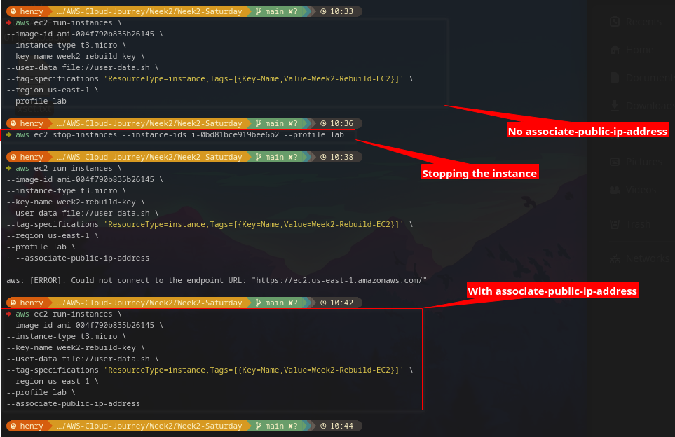
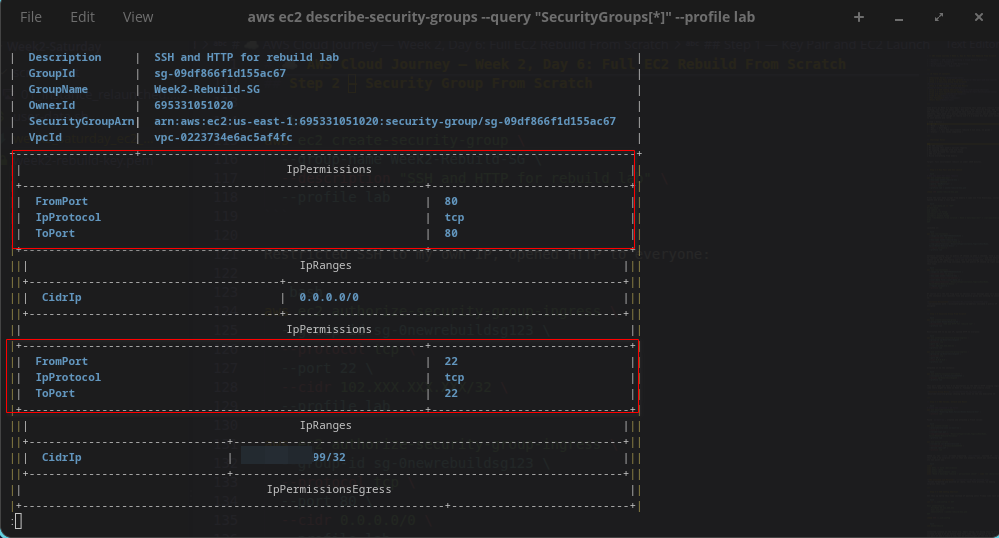
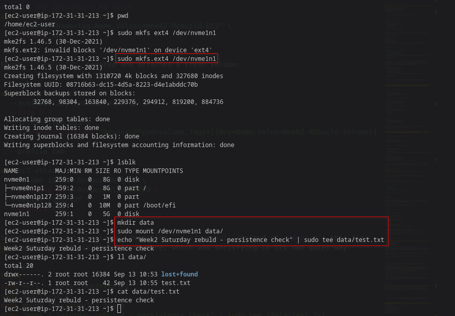
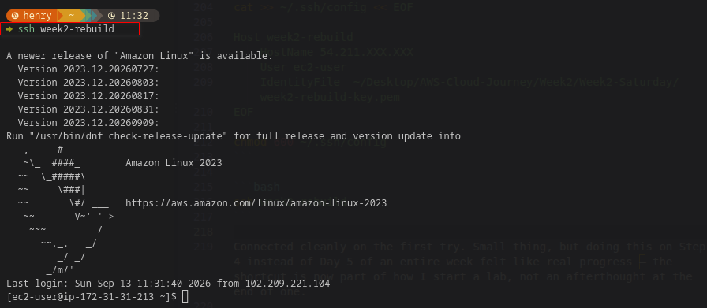
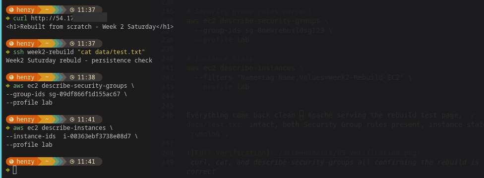
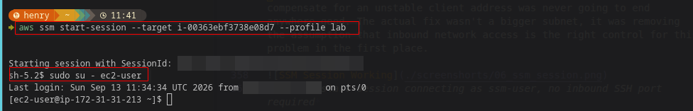

# ☁️ AWS Cloud Journey — Week 2, Day 6: Full EC2 Rebuild From Scratch

> **Roadmap:** AWS Cloud Networking → Cloud Network Security  
> **Phase:** 1 — Foundation  
> **Background:** Linux · CCNA Networking  
> **Date Completed:** August 2026

---

## 📋 Table of Contents

- [Challenge Rules](#challenge-rules)
- [Step 1 — Key Pair and EC2 Launch](#step-1--key-pair-and-ec2-launch)
- [Step 2 — Security Group From Scratch](#step-2--security-group-from-scratch)
- [Step 3 — EBS Volume, Attach and Mount](#step-3--ebs-volume-attach-and-mount)
- [Step 4 — SSH Config Shortcut](#step-4--ssh-config-shortcut)
- [Step 5 — Full Verification Sweep](#step-5--full-verification-sweep)
- [Time and Results](#time-and-results)
- [Update — Retiring SSH for SSM](#update--retiring-ssh-for-ssm)
- [CCNA Bridge](#ccna-bridge)
- [Key Takeaways](#key-takeaways)
- [Whats Next](#whats-next)

---

Same drill as Week 1's Saturday — everything this week gets rebuilt from nothing, CLI only, no notes open. Key pair, EC2, Security Group, EBS volume, SSH shortcut, all of it. Last week this kind of rebuild was about IAM identity. This week it's actual running infrastructure, which somehow feels higher stakes even though it really isn't — a broken EC2 lab costs nothing to just delete and retry.

| Item | Detail |
|---|---|
| **Week** | Week 2 |
| **Day** | Saturday |
| **Focus** | Full EC2 environment rebuild — CLI only, no guide |
| **Status** | All tasks completed |

---

## Challenge Rules

```
✗ No AWS console
✗ No opening this week's earlier reports
✗ No copying commands from old files
✓ aws help allowed for syntax lookup
✓ AWS CLI only
✓ Build everything from memory
```

Target: full environment rebuilt in under 40 minutes.

---

## Step 1 — Key Pair and EC2 Launch

```bash
# New key pair for this rebuild
aws ec2 create-key-pair \
  --key-name week2-rebuild-key \
  --key-type ed25519 \
  --query 'KeyMaterial' \
  --output text \
  --profile lab > week2-rebuild-key.pem

chmod 400 week2-rebuild-key.pem
```

Wrote the user data script from memory — same one from Wednesday, installs Apache and drops a test page:

```bash
cat > user-data.sh << 'EOF'
#!/bin/bash
yum update -y
yum install -y httpd
systemctl start httpd
systemctl enable httpd
echo "<h1>Rebuilt from scratch - Week 2 Saturday</h1>" > /var/www/html/index.html
EOF
```

Launched it:

```bash
aws ec2 run-instances \
  --image-id ami-004f790b835b26145 \
  --instance-type t3.micro \
  --key-name week2-rebuild-key \
  --user-data file://user-data.sh \
  --tag-specifications 'ResourceType=instance,Tags=[{Key=Name,Value=Week2-Rebuild-EC2}]' \
  --region us-east-1 \
  --profile lab
```

Instance launched, but no public IP showed up when I checked. Took a second to remember why — forgot `--associate-public-ip-address`, and the default subnet in my VPC apparently isn't set to auto-assign one. Terminated it, relaunched with the flag included, and the public IP showed up right away this time.

```bash
aws ec2 run-instances \
  --image-id ami-004f790b835b26145 \
  --instance-type t3.micro \
  --key-name week2-rebuild-key \
  --associate-public-ip-address \
  --user-data file://user-data.sh \
  --tag-specifications 'ResourceType=instance,Tags=[{Key=Name,Value=Week2-Rebuild-EC2}]' \
  --region us-east-1 \
  --profile lab
```

Of course it's the one flag with no obvious error message when it's missing — the instance just launches fine and quietly gives you nothing to connect to.



*run-instances with --associate-public-ip-address included — public IP assigned*

---

## Step 2 — Security Group From Scratch

```bash
aws ec2 create-security-group \
  --group-name Week2-Rebuild-SG \
  --description "SSH and HTTP for rebuild lab" \
  --profile lab
```

Restricted SSH to my own IP, opened HTTP to everyone:

```bash
aws ec2 authorize-security-group-ingress \
  --group-id sg-0newrebuildsg123 \
  --protocol tcp \
  --port 22 \
  --cidr 102.XXX.XXX.XXX/32 \
  --profile lab

aws ec2 authorize-security-group-ingress \
  --group-id sg-0newrebuildsg123 \
  --protocol tcp \
  --port 80 \
  --cidr 0.0.0.0/0 \
  --profile lab
```

Attached it to the instance:

```bash
aws ec2 modify-instance-attribute \
  --instance-id i-0rebuild123456789 \
  --groups sg-0newrebuildsg123 \
  --profile lab
```

This part came out fast — no hesitation on the SSH-vs-HTTP scoping logic like there might've been in Week 1. Tuesday's lab clearly stuck.



*describe-security-groups showing both rules on the new dedicated SG*

---

## Step 3 — EBS Volume, Attach and Mount

```bash
# Check the instance's AZ first
aws ec2 describe-instances \
  --filters "Name=tag:Name,Values=Week2-Rebuild-EC2" \
  --profile lab
```

Found `us-east-1a`, created and attached a fresh volume:

```bash
aws ec2 create-volume \
  --availability-zone us-east-1a \
  --size 5 \
  --volume-type gp3 \
  --tag-specifications 'ResourceType=volume,Tags=[{Key=Name,Value=Week2-Rebuild-Volume}]' \
  --profile lab

aws ec2 attach-volume \
  --volume-id vol-0rebuildvol123 \
  --instance-id i-0rebuild123456789 \
  --device /dev/sdf \
  --profile lab
```

SSHed in, ran `lsblk` already expecting `/dev/nvme1n1` instead of `/dev/sdf` this time — no surprise left in that one anymore, which was satisfying in its own quiet way.

```bash
lsblk
sudo mkfs -t ext4 /dev/nvme1n1
sudo mkdir /data
sudo mount /dev/nvme1n1 /data
echo "Week 2 Saturday rebuild - persistence check" | sudo tee /data/test.txt
```


*Volume formatted and mounted at /data, test file written, no naming surprise this time*

---

## Step 4 — SSH Config Shortcut

Set this up early this time instead of waiting until Friday like last week.

```bash
cat >> ~/.ssh/config << EOF

Host week2-rebuild
    HostName 54.211.XXX.XXX
    User ec2-user
    IdentityFile  ~/Desktop/AWS-Cloud-Journey/Week2/Week2-Saturday/week2-rebuild-key.pem
EOF

chmod 600 ~/.ssh/config
```

```bash
ssh week2-rebuild
```

Connected cleanly on the first try. Small thing, but doing this on Step 4 instead of Day 5 of an entire week felt like real progress — the shortcut is now part of how I start a lab, not an afterthought at the end of one.


*ssh week2rebuild connecting immediately using the config alias*

---

## Step 5 — Full Verification Sweep

```bash
# Web server responding
curl http://54.211.XXX.XXX

# Data volume mounted and persisted
ssh week2rebuild "cat /data/test.txt"

# Security group rules correct
aws ec2 describe-security-groups \
  --group-ids sg-0newrebuildsg123 \
  --profile lab

# Instance state
aws ec2 describe-instances \
  --filters "Name=tag:Name,Values=Week2-Rebuild-EC2" \
  --profile lab
```

Everything came back clean — Apache serving the rebuild test page, `/data/test.txt` intact, both Security Group rules present, instance state `running`.


*curl, cat, and describe-security-groups all confirming the rebuild is correct*

---

## Time and Results

| Target | Actual |
|---|---|
| Under 40 minutes | 43 minutes |
| No console | Achieved |
| No notes | Achieved |
| Everything working | Verified |

Went over target by 3 minutes, mostly eaten up by the missing `--associate-public-ip-address` flag and the relaunch it caused. Not going to pretend that didn't happen just to hit a clean number — the whole point of these rebuilds is finding out what actually didn't stick from muscle memory yet, and that flag clearly hadn't.

**What came back instantly:** Security Group scoping logic, the nvme device naming, the SSH config pattern.

**What still needs another rep:** remembering every required launch flag without checking `aws help` first.

---

## Update — Retiring SSH for SSM

A few days after this rebuild, the SSH access from Step 2 started failing intermittently — not a security group misconfiguration, something worse to pin down: it worked, then it didn't, then it did again, with nothing in the setup actually changing.

### Chasing the real cause

Turned out my ISP rotates my public IPv4 address through CGNAT, so the single `/32` rule from Step 2 kept going stale without warning. Confirmed the host and SSH daemon were both healthy by temporarily opening port 22 to `0.0.0.0/0` — connected instantly, which proved the firewall rule was the only thing wrong, not the instance.

From there I tried to find a CIDR wide enough to survive the IP rotation without opening the whole internet:

```
/32  → too narrow, breaks every time the ISP rotates me
/24  → still failed — the ISP rotates across more than one /24 block
/16  → finally worked
```

The `/16` "fix" is really a red flag, not a fix — it means my ISP's CGNAT pool spans up to 65,536 addresses, so a rule wide enough to survive the rotation is also wide enough to let in every other customer on that same ISP block. Widening the CIDR further wasn't a real option.

### The actual fix — remove the inbound port entirely

Instead of guessing at a subnet size, I set up **SSM Session Manager**, which doesn't need an inbound SSH port at all — the instance reaches out to AWS, so my IP changing is irrelevant.

```bash
# Trust policy — let EC2 assume this role
cat <<'EOF' > ec2-ssm-trust.json
{
  "Version": "2012-10-17",
  "Statement": [
    {
      "Effect": "Allow",
      "Principal": { "Service": "ec2.amazonaws.com" },
      "Action": "sts:AssumeRole"
    }
  ]
}
EOF

aws iam create-role \
  --role-name EC2-SSM-Role \
  --assume-role-policy-document file://ec2-ssm-trust.json \
  --profile lab

aws iam attach-role-policy \
  --role-name EC2-SSM-Role \
  --policy-arn arn:aws:iam::aws:policy/AmazonSSMManagedInstanceCore \
  --profile lab

aws iam create-instance-profile \
  --instance-profile-name EC2-SSM-Instance-Profile \
  --profile lab

aws iam add-role-to-instance-profile \
  --instance-profile-name EC2-SSM-Instance-Profile \
  --role-name EC2-SSM-Role \
  --profile lab
```

Connected with:

```bash
aws ssm start-session --target i-0rebuild123456789 --profile lab
```

Landed as `ssm-user`, not `ec2-user` — a session identity SSM creates and authorizes on the fly through IAM, rather than a permanent account tied to a key file sitting on my laptop. To get the same access I had over SSH:

```bash
sudo su - ec2-user
```

### Closing the loop

With SSM working, the port 22 rule wasn't just stale — it was unnecessary. Removed it entirely instead of maintaining any CIDR at all:

```bash
aws ec2 revoke-security-group-ingress \
  --group-id sg-0newrebuildsg123 \
  --protocol tcp \
  --port 22 \
  --cidr 102.207.0.0/16 \
  --profile lab
```

No inbound management port on this instance anymore. The Security Group from Step 2 now only has the HTTP rule left.

### Why this is a better outcome than the original Step 2

The original goal in Step 2 was "restrict SSH to my own IP." That's the right instinct, but it assumes the IP is a stable thing to restrict *to* — and on a CGNAT connection, it isn't. Chasing wider and wider CIDRs to compensate for an unstable client address was never going to end anywhere good. The actual fix wasn't a bigger subnet, it was removing the assumption that inbound network access is the right control for this problem in the first place.


*aws ssm start-session connecting as ssm-user, no inbound SSH port required*

---

## CCNA Bridge

Same spirit as every Saturday rebuild — configure the whole thing from memory, discover what's actually retained versus what was just copied along at the time.

| CCNA Saturday Habit | This Week's Version |
|---|---|
| Rebuild VLANs, trunks, ACLs from memory | Rebuild EC2, SG, EBS from memory |
| Forgetting one interface command breaks the whole topology silently | Forgetting `--associate-public-ip-address` breaks connectivity silently |
| `show run` to compare against what you intended | `describe-instances` / `describe-security-groups` to verify |
| Some commands come back instantly, others need a cheat sheet | Same exact experience, different vendor |
| Out-of-band management port (aux/console) as a separate, always-available path | SSM Session Manager — access that doesn't depend on the data-plane firewall rules at all |

The forgotten-flag mistake today is really the cloud version of forgetting `no shutdown` on a freshly configured interface — everything else was right, but the one flag with no visible error message is exactly the kind that costs you ten minutes of confused troubleshooting.

---

## Key Takeaways

```
Security Group and EBS naming muscle memory both held up well from this week's labs
--associate-public-ip-address is silent when missing — no error, just no public IP
Set up the SSH config shortcut on Step 4 this time instead of waiting until day 5
1H55 minutes is an honest number, not a clean one — and that's actually more useful to know
A CIDR wide enough to survive CGNAT rotation is also wide enough to be a real exposure
SSM Session Manager removes the inbound port entirely instead of guessing at a subnet size
ssm-user is authorized per-session through IAM — not a permanent key sitting on my laptop
```

---

## Whats Next

**Tomorrow:** Sunday review — going back over the week, plus a look at EC2 pricing so free tier limits stay actual limits and not just a rumor I half-remember.

---

### Screenshots Folder Structure
```
Week2-saturday/
├── screenshorts/
│   ├── 01_instance_relaunched.png
│   ├── 02_sg_rules.png
│   ├── 03_ebs_mounted.png
│   ├── 04_ssh_shortcut.png
│   ├── 05_verification.png
│   └── 06_ssm_session.png
├── ec2-ssm-trust.json
├── user-data.sh
└── week2_saturday_ec2_rebuild.md
```

---

*Part of my AWS Cloud Networking roadmap — from Linux & CCNA background to Cloud Network Security Engineer.*
