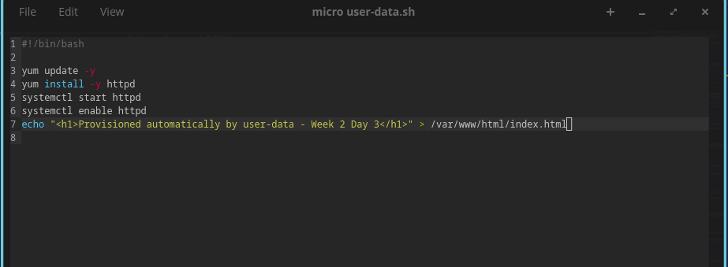
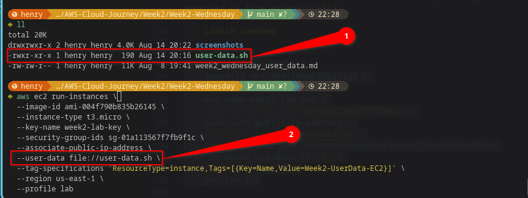
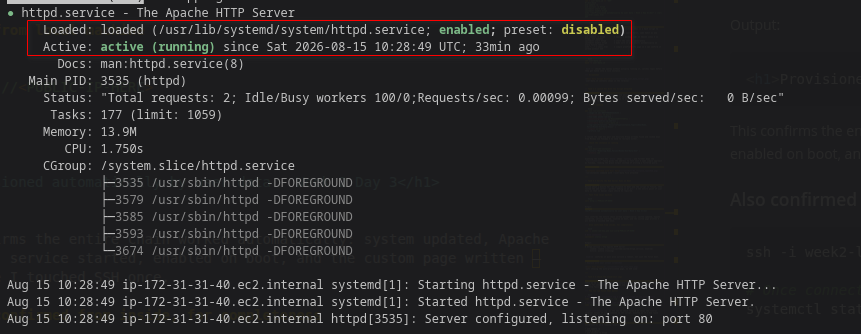
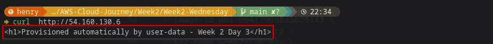
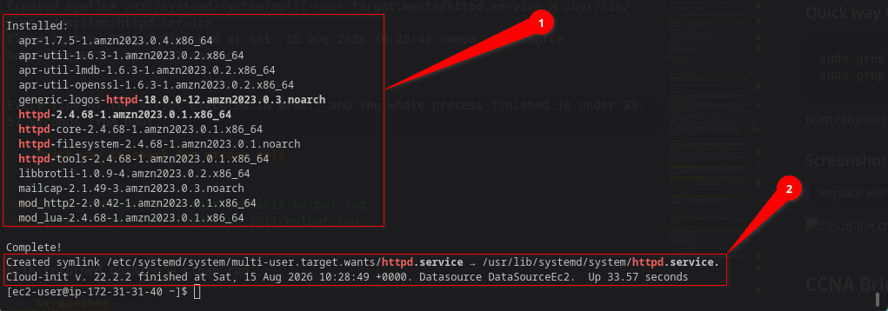

# ☁️ AWS Cloud Journey — Week 2, Day 3: User Data Scripts — Auto-Provisioning Apache

> **Roadmap:** AWS Cloud Networking → Cloud Network Security  
> **Phase:** 1 — Foundation  
> **Background:** Linux · CCNA Networking  
> **Date Completed:** August 2026

---

## 📋 Table of Contents

- [Overview](#overview)
- [Task 1 — Write the User Data Script](#task-1--write-the-user-data-script)
- [Task 2 — Launch EC2 With the Script Attached](#task-2--launch-ec2-with-the-script-attached)
- [Task 3 — Verify the Web Server Runs on Boot](#task-3--verify-the-web-server-runs-on-boot)
- [Task 4 — Check the Cloud-Init Logs](#task-4--check-the-cloud-init-logs)
- [CCNA Bridge](#ccna-bridge)
- [Key Takeaways](#key-takeaways)
- [Whats Next](#whats-next)

---

## Overview

This is **Day 3 of Week 2**. Today focus is **user data scripts**: bash scripts that run automatically the first time an EC2 instance boots, with zero manual SSH steps required to get a working web server.

This is the first real taste of automation in the roadmap. Instead of SSHing in and typing commands by hand like Tuesday, the instance configures itself the moment it powers on.

| Item | Detail |
|---|---|
| **Week** | Week 2 |
| **Day** | Wednesday |
| **Focus** | User data scripts, auto-provisioning, cloud-init |
| **Time Invested** | ~2 hours |
| **AWS Free Tier** | Active |
| **Status** | All tasks completed |

---

## Task 1 — Write the User Data Script

### What I did
Wrote a bash script that, when handed to EC2 at launch time, automatically updates the system, installs Apache, starts it, enables it on boot, and drops a simple test page.

### The script

```bash
cat > user-data.sh << 'EOF'
#!/bin/bash
yum update -y
yum install -y httpd
systemctl start httpd
systemctl enable httpd
echo "<h1>Provisioned automatically by user data - Week 2 Day 3</h1>" > /var/www/html/index.html
EOF
```

### Why each line matters

```
#!/bin/bash                 → tells the instance this is a bash script to execute
yum update -y                → patch the system first, same habit as any fresh server
yum install -y httpd         → Apache's package name on Amazon Linux 2 is httpd, not apache2
systemctl start httpd        → start the service immediately
systemctl enable httpd       → make sure it also starts automatically on every future reboot
echo "..." > index.html      → simple proof-of-life page so I can confirm it worked without SSH
```

### Check the script is valid before using it

```bash
cat user-data.sh
bash -n user-data.sh
```

`bash -n` checks the syntax without actually running it, catches typos before they get baked into a live instance.

### Screenshot


*user-data.sh contents shown in the terminal*

---

## Task 2 — Launch EC2 With the Script Attached

### What I did
Launched a brand new EC2 instance and passed the script in using `--user-data`. This has to happen at launch time, user data only runs on **first boot**, so it can't be added to an already-running instance and expected to fire automatically.

### Launch command

```bash
aws ec2 run-instances \
  --image-id ami-004f790b835b26145 \
  --instance-type t3.micro \
  --key-name week2-lab-key \
  --security-group-ids sg-01a113567f7fb9f1c \
  --associate-public-ip-address \
  --user-data file://user-data.sh \
  --tag-specifications 'ResourceType=instance,Tags=[{Key=Name,Value=Week2-UserData-EC2}]' \
  --region us-east-1 \
  --profile lab
```

I reused the same key pair and Security Group already fixed and locked down from Monday and Tuesday — no need to recreate either.

### Check the instance is running

```bash
aws ec2 describe-instances \
  --filters "Name=tag:Name,Values=Week2-UserData-EC2" \
  --profile lab
```

Scanning the output for `State` shows `running`, and further down the `PublicIpAddress` field gives the address to test next — same simple approach as Tuesday, reading the plain output instead of writing a filtered query.

### Screenshot


*run-instances command with --user-data file attached*

---

## Task 3 — Verify the Web Server Runs on Boot

### What I did
Waited about a minute for the instance to boot and the script to finish, then tested the web server **without SSHing in at all** — the entire point of user data is that no manual login should be required.

### Test from local machine

```bash
curl http://<PUBLIC-IP-HERE>
```

Output:
```html
<h1>Provisioned automatically by user data - Week 2 Day 3</h1>
```

This confirms the entire chain worked automatically: system updated, Apache installed, service started, enabled on boot, and the custom page written — all before I touched SSH once.

### Also confirmed from inside, for completeness

```bash
ssh -i week2-lab-key.pem ec2-user@<PUBLIC-IP-HERE>

# Once connected
systemctl status httpd
```

Output:
```
● httpd.service - The Apache HTTP Server
     Loaded: loaded (/usr/lib/systemd/system/httpd.service; enabled)
     Active: active (running)
```

`enabled` confirms it will also survive a reboot, not just the first boot.

### Screenshot


*httpd.service - The Apache HTTP server was enabled, and running*


*curl showing the auto-provisioned page, no SSH used*


---

## Task 4 — Check the Cloud-Init Logs

### What I did
SSHed in to look at the logs that record exactly what happened during boot — useful for understanding the process and essential for debugging if a script silently fails.

### The two log files that matter

```bash
# The high-level cloud-init log — shows each stage of the boot process
sudo cat /var/log/cloud-init.log

# The actual output of the user data script itself — what you really want
sudo cat /var/log/cloud-init-output.log
```

`cloud-init-output.log` is the one to check first — it shows the literal terminal output of every command in the script, exactly as if I had typed them by hand over SSH.

### What I saw

```
Cloud-init v. 22.2.2 running 'modules:config' ...
Cloud-init v. 22.2.2 running 'modules:final' ...
---
Installed:
  apr-1.7.5-1.amzn2023.0.4.x86_64
  apr-util-1.6.3-1.amzn2023.0.2.x86_64
  apr-util-lmdb-1.6.3-1.amzn2023.0.2.x86_64
  apr-util-openssl-1.6.3-1.amzn2023.0.2.x86_64
  generic-logos-httpd-18.0.0-12.amzn2023.0.3.noarch
  httpd-2.4.68-1.amzn2023.0.1.x86_64
---

Complete!
Created symlink /etc/systemd/system/multi-user.target.wants/httpd.service → /usr/lib/systemd/system/httpd.service.
Cloud-init v. 22.2.2 finished at Sat, 15 Aug 2026 10:28:49 +0000. Datasource DataSourceEc2.  Up 33.57 seconds
```

Every line of the script executed in order, and the whole process finished in under 33.57 seconds from boot.

### Quick way to check for errors only

```bash
sudo grep -i error /var/log/cloud-init-output.log
sudo grep -i fail /var/log/cloud-init-output.log
```

Both returned nothing — clean run.

### Screenshot


*cloud-init-output.log showing the script's commands executing in order*

---

## CCNA Bridge

User data is the cloud equivalent of a router loading its startup-config automatically the moment it powers on — except instead of interface and routing commands, it's a bash script installing software.

| Cisco IOS (2911) | AWS User Data Equivalent |
|---|---|
| `startup-config` stored in NVRAM | User data script attached at launch |
| Router reads startup-config automatically on boot | cloud-init reads user data automatically on first boot |
| Config applied without a human typing each line | Script runs without SSH ever being used |
| `show startup-config` | `cat user-data.sh` (before launch) |
| `show logging` (boot process visibility) | `/var/log/cloud-init-output.log` |
| Config only applies fully on a fresh boot cycle | User data only executes on the instance's first boot |
| Manually typing `copy running-config startup-config` to persist changes | Not applicable — user data is a one-time script, not a persistent config file |

**Key difference:** a 2911's startup-config re-applies on every single boot, every time. EC2 user data by default only runs **once**, on the very first boot after launch — rebooting the instance later does not re-run the script unless you specifically configure it to (using tools like `cloud-init per-boot` scripts, which is a more advanced pattern for later).

---

## Key Takeaways

```
User data scripts run automatically on first boot only — not on every reboot
--user-data must be passed at launch time, not added to a running instance
yum install -y httpd installs Apache on Amazon Linux 2 — package name is httpd, not apache2
Tested with curl before ever using SSH — proves true automation, not just a working script
cloud-init-output.log is the single most useful file for debugging a user data script
bash -n checks script syntax before launch — catches mistakes before they're baked in
Reused Monday's key pair and Tuesday's Security Group — no need to rebuild what already works
```

### One thing that clicked today
The moment `curl` returned the custom HTML page before I had SSHed into the instance even once, it actually felt like real automation — not just "I know the commands," but "the server configures itself." That's a meaningfully different feeling from every previous lab this week.

### One thing to watch for going forward
If a user data script has a typo or fails partway through, there's no error message shown anywhere visible — the instance just boots normally with a broken configuration. `cloud-init-output.log` is the only place that failure shows up. Always check it after any real deployment, not just when something looks wrong.

---

## Whats Next

| Day | Focus |
|---|---|
| **Thursday** | EBS volumes — attach, format, mount additional storage |
| **Friday** | SCP and rsync — file transfer to and from EC2 |
| **Saturday** | Full EC2 lab rebuild from scratch — CLI only |
| **Sunday** | Review + EC2 pricing and cost awareness |

---

## Resources Used

- [EC2 User Data Documentation](https://docs.aws.amazon.com/AWSEC2/latest/UserGuide/user-data.html)
- [cloud-init Documentation](https://cloudinit.readthedocs.io/en/latest/)
- [Amazon Linux 2 Package Reference](https://docs.aws.amazon.com/AL2/latest/relnotes/relnotes.html)

---

## Screenshots Folder Structure

```
Week2-wednesday/
├── screenshorts/
│   ├── 01_user_data_script.png
│   ├── 02_instance_launched.png
│   ├── 03_curl_test.png
│   ├── 33_httpd_systemctl.png
│   └── 04_cloud_init_output_log.png
├── user-data.sh
└── week2_wednesday_user_data.md


```

> **Tip:** Same `screenshorts/` naming pattern — relative paths, push alongside the `.md` file.

---

*Part of my AWS Cloud Networking roadmap — from Linux & CCNA background to Cloud Network Security Engineer.*  
*Follow along as I document each week of labs and learning.*
