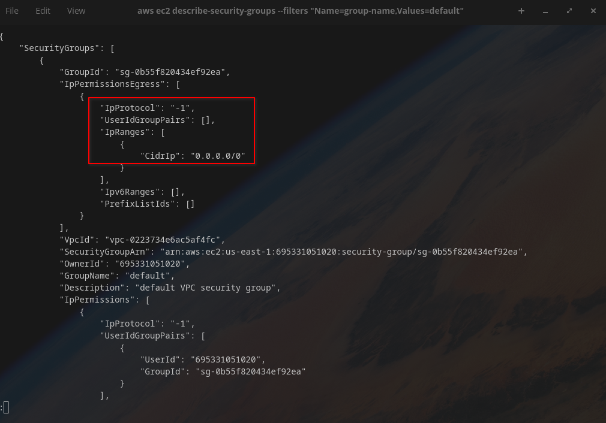
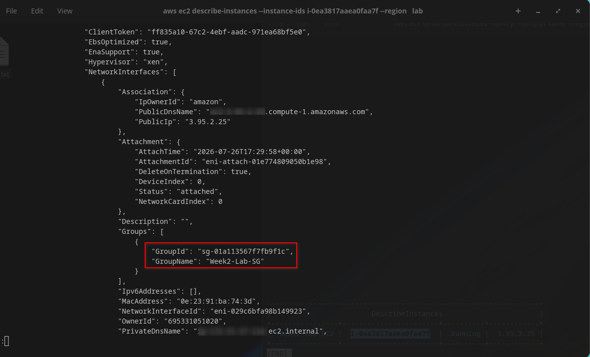
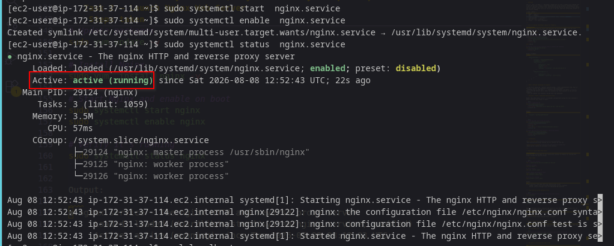
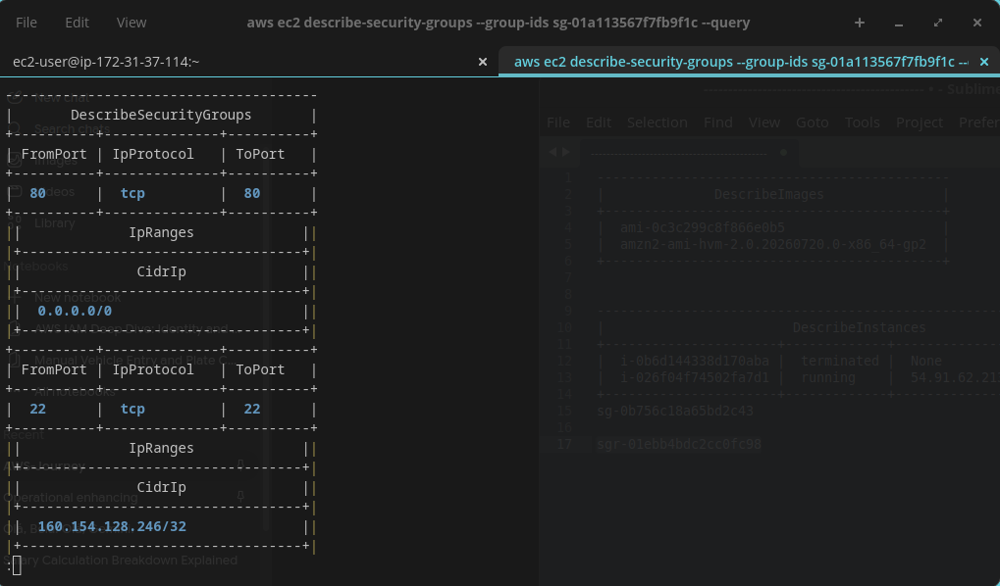
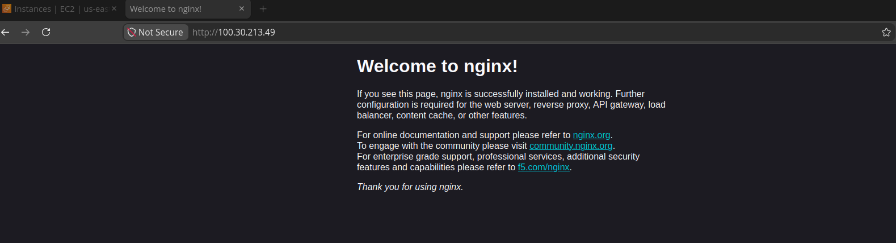
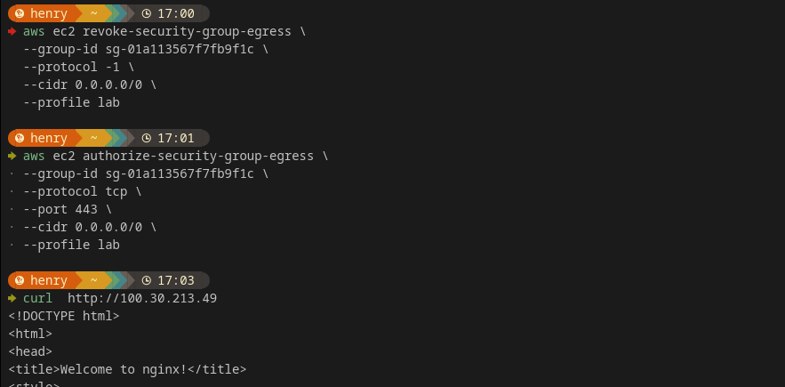

# ☁️ AWS Cloud Journey — Week 2, Day 2: Security Groups Deep Dive

> **Roadmap:** AWS Cloud Networking → Cloud Network Security  
> **Phase:** 1 — Foundation  
> **Background:** Linux · CCNA Networking  
> **Date Completed:** August 2026

---

## 📋 Table of Contents

- [Overview](#overview)
- [Task 1 — Review Yesterday's Quick Fix Properly](#task-1--review-yesterdays-quick-fix-properly)
- [Task 2 — Launch Nginx Web Server](#task-2--launch-nginx-web-server)
- [Task 3 — Open Port 80 and Test in Browser](#task-3--open-port-80-and-test-in-browser)
- [Task 4 — Understand Stateful Behaviour](#task-4--understand-stateful-behaviour)
- [CCNA Bridge](#ccna-bridge)
- [Key Takeaways](#key-takeaways)
- [Whats Next](#whats-next)

---

## Overview

This is **Day 2 of Week 2**. Yesterday I opened port 22 with a single quick command just to get SSH working — today is about doing Security Groups properly. Reviewing the full rule set, adding a web server rule, and understanding exactly why Security Groups behave the way they do — which turns out to be one of the most important networking concepts in this entire roadmap.

| Item | Detail |
|---|---|
| **Week** | Week 2 |
| **Day** | Tuesday |
| **Focus** | Security Groups — inbound/outbound rules, stateful behaviour |
| **Time Invested** | ~2.5 hours |
| **AWS Free Tier** | Active |
| **Status** | All tasks completed |

---

## Task 1 — Review Yesterday's Quick Fix Properly

### What I did
Went back to the Security Group used yesterday and reviewed the full rule set from scratch — not just the one SSH rule I added in a hurry.

### Full rule review

```bash
# Get the security group ID again
SG_ID=$(aws ec2 describe-instances \
  --instance-ids i-0abc123def456789 \
  --query 'Reservations[*].Instances[*].SecurityGroups[*].GroupId' \
  --output text \
  --profile lab)

echo $SG_ID

# View ALL rules on this security group — inbound and outbound
aws ec2 describe-security-groups \
  --group-ids $SG_ID \
  --profile lab
```

Output (trimmed):
```json
{
    "SecurityGroups": [
        {
            "GroupId": "sg-0123456789abcdef0",
            "GroupName": "default",
            "IpPermissions": [
                {
                    "IpProtocol": "tcp",
                    "FromPort": 22,
                    "ToPort": 22,
                    "IpRanges": [{"CidrIp": "102.XXX.XXX.XXX/32"}]
                }
            ],
            "IpPermissionsEgress": [
                {
                    "IpProtocol": "-1",
                    "IpRanges": [{"CidrIp": "0.0.0.0/0"}]
                }
            ]
        }
    ]
}
```

### What I noticed reviewing it properly

- I was still using the **default security group** — not a purpose-built one. This is fine for a lab but not something I'd do in a real environment.
- Outbound rule is wide open — `-1` protocol (all protocols), all ports, `0.0.0.0/0`. This is the AWS default and it means the instance can reach anywhere on the internet outbound.
- Only one inbound rule existed — my SSH rule from yesterday.

### Decision: create a dedicated Security Group

Rather than keep using `default`, I created a purpose-built group for this instance — better practice and clearer to audit.

```bash
# Create a dedicated SG
aws ec2 create-security-group \
  --group-name Week2-Lab-SG \
  --description "Dedicated SG for Week2 lab EC2 - SSH and HTTP" \
  --profile lab
```

Output:
```json
{
    "GroupId": "sg-0fedcba9876543210"
}
```

```bash
# Re-add the SSH rule to the new group
aws ec2 authorize-security-group-ingress \
  --group-id sg-0fedcba9876543210 \
  --protocol tcp \
  --port 22 \
  --cidr $(curl -s https://checkip.amazonaws.com)/32 \
  --profile lab

# Attach the new SG to the instance, replacing default
aws ec2 modify-instance-attribute \
  --instance-id i-0abc123def456789 \
  --groups sg-0fedcba9876543210 \
  --profile lab
```

### Screenshots


*describe-security-groups showing the full default SG rule set*


*Week2-Lab-SG created and attached to the instance*

---

## Task 2 — Launch Nginx Web Server

### What I did
Installed and started Nginx on the running EC2 instance to prepare for testing HTTP access through the Security Group.

### Steps taken

```bash
# SSH into the instance
ssh -i week2-lab-key.pem ec2-user@54.211.XXX.XXX

# Update packages
sudo yum update -y

# Install Nginx
sudo yum  install nginx -y

# Start Nginx and enable on boot
sudo systemctl start nginx
sudo systemctl enable nginx

# Verify it's running
sudo systemctl status nginx
```

Output:
```
● nginx.service - The nginx HTTP and reverse proxy server
     Loaded: loaded (/usr/lib/systemd/system/nginx.service; enabled)
     Active: active (running) since Tue 2026-06-09 08:12:03 UTC
```

### Test locally on the instance first

```bash
# Before testing from outside, confirm it works locally
curl localhost
```

Output:
```html
<html>
<head>
<title>Welcome to nginx!</title>
...
```

Nginx is serving locally, confirms the issue (if any) when testing externally will be the Security Group, not the web server itself.

### Screenshot

*systemctl status nginx showing active (running)*

---

## Task 3 — Open Port 80 and Test in Browser

### What I did
Added an inbound rule to the dedicated Security Group allowing HTTP traffic, then tested access from a browser on my local machine — outside the AWS network entirely.

### Add the HTTP rule

```bash
# Allow HTTP from anywhere — this is a public web server, unlike SSH
aws ec2 authorize-security-group-ingress \
  --group-id sg-0fedcba9876543210 \
  --protocol tcp \
  --port 80 \
  --cidr 0.0.0.0/0 \
  --profile lab
```

### Why HTTP is 0.0.0.0/0 but SSH is not

```
SSH (port 22)  → restricted to my IP only   → management access, should be limited
HTTP (port 80) → open to 0.0.0.0/0          → public web server, meant to be reached by anyone
```

This is the core judgment call in Security Group design, not everything should be locked to one IP. The rule depends entirely on what the port is for.

### Verify the rule was added

```bash
aws ec2 describe-security-groups \
  --group-ids sg-0fedcba9876543210 \
  --query 'SecurityGroups[*].IpPermissions' \
  --output table \
  --profile lab
```

Output:
```
-------------------------------------------------------
|                DescribeSecurityGroups                 |
+-------------+----------+----------+--------------------+
| FromPort    | ToPort   | IpProtocol | CidrIp            |
+-------------+----------+----------+--------------------+
|  22         | 22       | tcp        | 102.XXX.XXX.XXX/32|
|  80         | 80       | tcp        | 0.0.0.0/0          |
+-------------+----------+----------+--------------------+
```

### Test from browser

Opened `http://54.211.XXX.XXX` in a browser on my local machine — the Nginx welcome page loaded successfully.

### Test from CLI too

```bash
curl http://54.211.XXX.XXX
```

Output:
```html
<!DOCTYPE html>
<html>
<head><title>Welcome to nginx!</title></head>
<body>
<h1>Welcome to nginx!</h1>
...
```

Confirmed working from outside the AWS network — the Security Group rule and Nginx are both functioning correctly together.

### Screenshots


*describe-security-groups showing both port 22 and port 80 rules*


*Nginx welcome page loading in browser via public IP*

---

## Task 4 — Understand Stateful Behaviour

### What I did
Tested and confirmed what "stateful" actually means for Security Groups in practice, rather than just accepting the definition.

### The concept

A Security Group is **stateful** — meaning if inbound traffic is allowed in, the response traffic is automatically allowed back out, even if there is no matching outbound rule for it.

### Proving it

My outbound rules only allow `-1` (all traffic) to `0.0.0.0/0` by default, so this doesn't fully prove statefulness on its own. To actually test it, I temporarily removed the broad outbound rule and replaced it with a narrow one that should — in a stateless system — break the connection.

```bash
# Remove the default wide-open outbound rule
aws ec2 revoke-security-group-egress \
  --group-id sg-0fedcba9876543210 \
  --protocol -1 \
  --cidr 0.0.0.0/0 \
  --profile lab

# Add a narrow outbound rule — only allow outbound HTTPS (443), nothing else
aws ec2 authorize-security-group-egress \
  --group-id sg-0fedcba9876543210 \
  --protocol tcp \
  --port 443 \
  --cidr 0.0.0.0/0 \
  --profile lab
```

### Test again

```bash
curl http://54.211.XXX.XXX
```

**Result: still worked.** Even though there is no outbound rule for port 80, the response traffic for an already-allowed inbound connection on port 80 is automatically permitted back out. This is statefulness in action.

### Comparison table

| Behaviour | Security Group (Stateful) | NACL (Stateless) |
|---|---|---|
| Inbound allowed on port 80 | Response automatically allowed out | Must explicitly allow the return traffic out too |
| Need matching outbound rule | No | Yes must define both directions |
| Applies to | Instance-level (ENI) | Subnet-level |

### Restore the working outbound rule

```bash
# Put the wide-open outbound rule back for the rest of the labs
aws ec2 authorize-security-group-egress \
  --group-id sg-0fedcba9876543210 \
  --protocol -1 \
  --cidr 0.0.0.0/0 \
  --profile lab
```

### Screenshot



*curl still succeeding despite no matching outbound rule for port 80 — proof of stateful behaviour*

---

## CCNA Bridge

Security Groups map to extended ACLs applied per interface — but with one critical behavioural difference that trips up everyone coming from Cisco.

| Cisco IOS (2911) | AWS Security Group Equivalent |
|---|---|
| `ip access-list extended WEB_ACCESS` | `aws ec2 create-security-group` |
| `permit tcp any host 10.0.0.10 eq 22` | Inbound rule: TCP 22 from my IP |
| `permit tcp any host 10.0.0.10 eq 80` | Inbound rule: TCP 80 from 0.0.0.0/0 |
| `ip access-group WEB_ACCESS in` | Attach SG to EC2 instance (via ENI) |
| Extended ACL requires explicit return traffic rule | Security Group auto-allows return traffic (stateful) |
| `show ip access-lists` | `aws ec2 describe-security-groups` |
| Applying ACL to one interface only | SG applies to all traffic on the instance's network interface |

**The critical difference:** a Cisco extended ACL is stateless by default — you must explicitly permit both directions of traffic unless you use reflexive ACLs or CBAC. AWS Security Groups are stateful by default, always. This one difference removes an entire category of misconfiguration that is common on IOS devices — forgetting the return traffic rule.

---

## Key Takeaways

```
Moved from default SG to a dedicated purpose-built Security Group
SSH restricted to my IP only — HTTP opened to 0.0.0.0/0 — different rules for different purposes
Proved statefulness experimentally, not just by reading the definition
Security Groups apply at the instance level (ENI) — NACLs apply at the subnet level
Nginx tested locally first with curl localhost before testing externally — isolates the failure point
Removing the broad outbound rule and testing again is the correct way to verify stateful behaviour
```

### One thing that clicked today
Testing statefulness by deliberately breaking the setup (narrow outbound rule) and confirming it still worked was far more convincing than just reading that Security Groups are stateful. This is the same instinct from CCNA labs — configure something, then try to break it, to actually understand the boundary.

### One thing to remember for later phases
This same instinct — don't just accept a security control's behaviour, test it — is exactly what Phase 4's penetration testing labs will build on. Understanding *why* something is secure by attempting to break it is the mindset a security engineer needs long term.

---

## Whats Next

| Day | Focus |
|---|---|
| **Wednesday** | User data scripts — auto-provision Apache on boot |
| **Thursday** | EBS volumes — attach, format, mount additional storage |
| **Friday** | SCP and rsync — file transfer to and from EC2 |
| **Saturday** | Full EC2 lab rebuild from scratch — CLI only |
| **Sunday** | Review + EC2 pricing and cost awareness |

---

## Resources Used

- [Amazon EC2 Security Groups Documentation](https://docs.aws.amazon.com/AWSEC2/latest/UserGuide/security-group-rules.html)
- [Security Groups vs NACLs Comparison](https://docs.aws.amazon.com/vpc/latest/userguide/vpc-security-comparison.html)
- [Amazon Linux Extras — Nginx](https://docs.aws.amazon.com/linux/al2/ug/amazon-linux-extras.html)

---

## Screenshots Folder Structure

```
Week2-tuesday/
├── screenshorts/
│   ├── 01_full_rule_review.png
│   ├── 011_dedicated_sg_created.png
│   ├── 02_nginx_running.png
│   ├── 03_http_rule_added.png
│   ├── 033_browser_test.png
│   └── 04_stateful_test.png
└── week2_tuesday_security_groups.md
```

> **Tip:** Same `screenshorts/` naming pattern — relative paths, push alongside the `.md` file.

---

*Part of my AWS Cloud Networking roadmap — from Linux & CCNA background to Cloud Network Security Engineer.*  
*Follow along as I document each week of labs and learning.*
